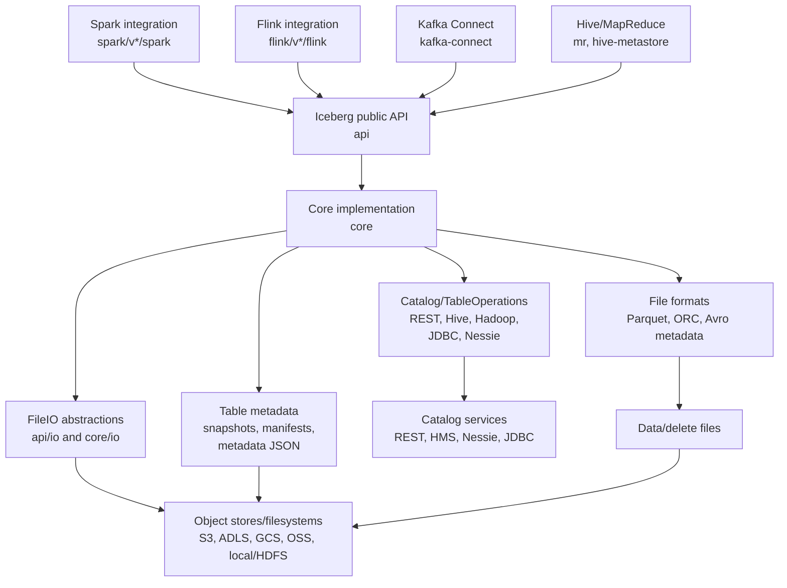
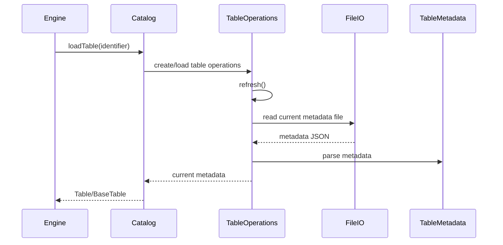
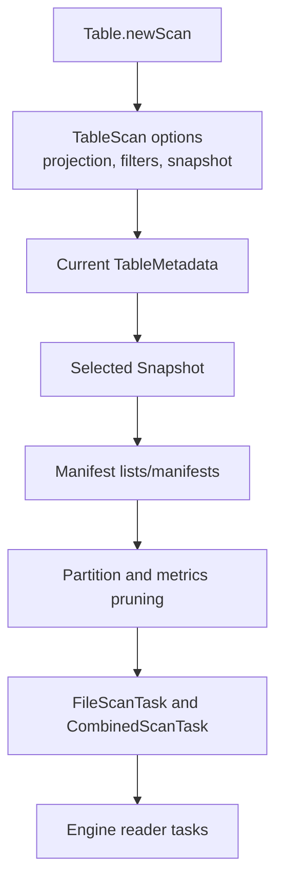
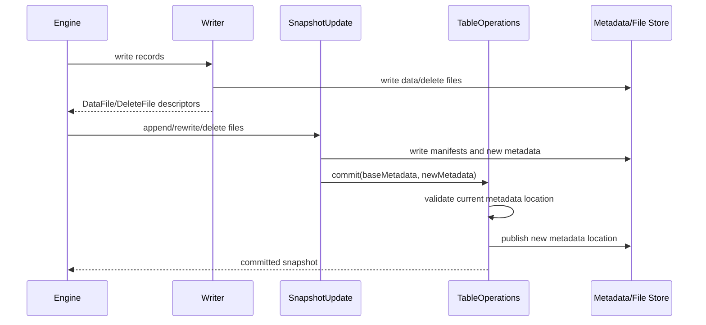
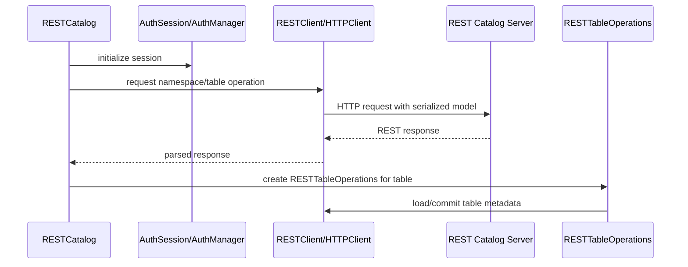

# Apache Iceberg Architecture Deep Dive

This document is a learning guide for engineers onboarding to this repository. It focuses on the Java reference implementation of Apache Iceberg and the major integration layers that adapt it to processing engines, catalogs, file formats, and object stores.

## 1. Executive Summary

Apache Iceberg is a table format for large analytic datasets. The core idea is that a table is described by immutable metadata files, snapshots, manifests, and data/delete files. Engines such as Spark, Flink, Hive, and Kafka Connect interact with those table abstractions through the Java API and delegate consistency, metadata evolution, scan planning, and commit behavior to Iceberg.

This repository is the Apache Iceberg Java monorepo. It contains the public API, the core implementation, file format integrations, catalog implementations, REST catalog support, engine adapters, cloud storage integrations, build tooling, and documentation/specification sources.

Most changes land in one of these areas:

- `api`: public contracts and stable domain interfaces.
- `core`: table metadata, snapshots, scan planning, commits, catalogs, REST support, and common implementations.
- `parquet`, `orc`, `arrow`, `data`: file reading/writing and JVM data model support.
- `spark`, `flink`, `mr`, `kafka-connect`: integration layers that adapt host engines to Iceberg.
- `aws`, `azure`, `gcp`, `aliyun`, `dell`, `snowflake`, `bigquery`, `nessie`, `hive-metastore`: backend, catalog, and platform-specific behavior.

The strongest mental model is a layered one: engines call Iceberg APIs, Iceberg core plans reads and commits metadata changes, catalogs coordinate table metadata locations, and storage/file-format modules read and write the actual files.

## 2. Monorepo Shape

The root Gradle build is defined in `settings.gradle` and `build.gradle`. `settings.gradle` declares the top-level projects and conditionally includes versioned Spark, Flink, and Kafka Connect modules based on Gradle properties. `build.gradle` centralizes Java compatibility, common dependencies, API compatibility checks, test behavior, and build plugins.

Module groups:

- Core libraries: `api`, `common`, `core`, `data`, `bundled-guava`, `bom`.
- File format and vectorization layers: `parquet`, `orc`, `arrow`.
- Catalog and metadata backends: `hive-metastore`, `nessie`, REST catalog code under `core/src/main/java/org/apache/iceberg/rest`, JDBC-related code under `core/src/main/java/org/apache/iceberg/jdbc`.
- Engine integrations: `spark`, `flink`, `mr`, `kafka-connect`.
- Cloud and vendor integrations: `aws`, `aws-bundle`, `azure`, `azure-bundle`, `gcp`, `gcp-bundle`, `aliyun`, `dell`, `snowflake`, `bigquery`, `delta-lake`.
- Specifications and user docs: `format`, `docs`, `site`, `open-api`.
- Build and project tooling: `gradle`, `project`, `.baseline`, `tasks.gradle`, `baseline.gradle`, `deploy.gradle`, `jmh.gradle`.

Versioned engine modules are important. Spark has `spark/v3.4`, `spark/v3.5`, and `spark/v4.0`. Flink has `flink/v1.20`, `flink/v2.0`, and `flink/v2.1`. These modules often duplicate structure because they compile against different engine APIs.

## 3. Architecture Overview

Architecturally, Iceberg separates table semantics from execution engines. The engine modules translate Spark/Flink/Hive/Kafka concepts into Iceberg scans, writes, row-level operations, and catalog calls. The core module owns the table-format behavior: metadata refresh, snapshot construction, manifest handling, scan planning, and optimistic commits.

The format specification in `format/spec.md` is the behavioral contract. Java classes in `api` and `core` are the reference implementation of that contract.

## 4. Core Domain Concepts

`Table` represents a logical Iceberg table. The public contract is `api/src/main/java/org/apache/iceberg/Table.java`; the common implementation is `core/src/main/java/org/apache/iceberg/BaseTable.java`. A table exposes schema, partitioning, sort order, snapshots, scans, and update builders.

`Schema` describes table columns, field IDs, and types. Schema-related types live under `api/src/main/java/org/apache/iceberg/types` and schema evolution logic appears in `core/src/main/java/org/apache/iceberg/schema`.

`PartitionSpec` describes how rows map into partition values. The public model is in `api/src/main/java/org/apache/iceberg/PartitionSpec.java` and related transform logic lives under `api/src/main/java/org/apache/iceberg/transforms`.

`SortOrder` describes logical ordering for writes and planning. The API-level classes live in `api/src/main/java/org/apache/iceberg`.

`Snapshot` represents a committed table state. Snapshots point to manifests and form table history. Public interfaces are in `api`; implementation and update machinery are in `core`, especially around `SnapshotProducer`.

`Manifest` files list data or delete files and their metadata. Manifest handling is implemented primarily in `core`, with Avro-based metadata file support under `core/src/main/java/org/apache/iceberg/avro`.

`DataFile` and `DeleteFile` describe physical files. Public models include `api/src/main/java/org/apache/iceberg/DataFile.java`, `api/src/main/java/org/apache/iceberg/DeleteFile.java`, and shared content interfaces.

`TableMetadata` is the serialized state of a table: current schema, partition specs, sort orders, snapshots, properties, refs, and metadata log. It is implemented in `core/src/main/java/org/apache/iceberg/TableMetadata.java`; JSON parsing is in `core/src/main/java/org/apache/iceberg/TableMetadataParser.java`.

`TableScan` plans reads. The public interface is `api/src/main/java/org/apache/iceberg/TableScan.java`; core planning implementation starts around `core/src/main/java/org/apache/iceberg/BaseTableScan.java` and related scan classes.

`Catalog` locates tables and namespaces. The public interface is `api/src/main/java/org/apache/iceberg/catalog/Catalog.java`. Catalog implementations construct or load `TableOperations`, which then manage metadata refresh and commit.

`TableOperations` is the core abstraction for loading current metadata and committing new metadata. It lives in `core/src/main/java/org/apache/iceberg/TableOperations.java`. Implementations include metastore-backed operations, REST-backed operations, Hadoop-style operations, and backend-specific variants.

## 5. Deep Dive By Major Module

### `api`

`api` contains public interfaces and value types that engines and applications depend on. It should remain stable and carefully versioned. Important packages include:

- `org.apache.iceberg`: table, scan, snapshot, schema, partition, file, transaction, and update contracts.
- `org.apache.iceberg.catalog`: catalog and namespace contracts.
- `org.apache.iceberg.expressions`: filter expressions and binding/evaluation abstractions.
- `org.apache.iceberg.io`: `FileIO`, `InputFile`, `OutputFile`, and related IO contracts.
- `org.apache.iceberg.metrics`, `events`, `encryption`, `view`, `variants`: public extension surfaces.

Start with `Table.java`, `TableScan.java`, `Catalog.java`, `FileIO.java`, and the update interfaces such as `AppendFiles`, `RewriteFiles`, `DeleteFiles`, and `Transaction`.

### `common`

`common` holds shared utilities used by other modules. Treat it as low-level support code. Changes here can have wide blast radius because many modules depend on it.

### `core`

`core` is the reference implementation of the table format. It implements table loading, metadata parsing, snapshot updates, manifest handling, scan planning, catalog clients, REST support, metrics reporting, delete handling, and utility implementations.

Key files and packages:

- `BaseTable.java`: concrete `Table` implementation.
- `TableOperations.java`: refresh and commit abstraction.
- `TableMetadata.java` and `TableMetadataParser.java`: table state and JSON serialization.
- `SnapshotProducer.java`: base machinery for snapshot-producing updates.
- `BaseMetastoreTableOperations.java`: shared behavior for metastore-backed commit implementations.
- `BaseTableScan.java` and `SnapshotScan.java`: scan planning implementation.
- `core/src/main/java/org/apache/iceberg/rest`: REST catalog client, request/response models, auth, retry, and serialization.
- `core/src/main/java/org/apache/iceberg/io`: IO helpers and implementations.
- `core/src/main/java/org/apache/iceberg/deletes`: delete file planning/application support.
- `core/src/main/java/org/apache/iceberg/puffin`: Puffin metadata file support.

`core` is the best place to study Iceberg behavior independent of any one engine.

### `data`

`data` provides generic JVM record and reader/writer utilities for direct Java use. It bridges Iceberg schemas to generic records and format readers/writers. Look at `data/src/main/java/org/apache/iceberg/data` when working on non-engine-specific row handling.

### `parquet`, `orc`, and `arrow`

`parquet` and `orc` implement file format integration: schema conversion, readers, writers, metrics, filters, vectorization hooks, and type visitors. `arrow` provides Arrow vector and columnar batch support, especially for vectorized reads.

Representative files:

- `parquet/src/main/java/org/apache/iceberg/parquet/Parquet.java`
- `parquet/src/main/java/org/apache/iceberg/parquet/ParquetReader.java`
- `parquet/src/main/java/org/apache/iceberg/parquet/ParquetWriter.java`
- `parquet/src/main/java/org/apache/iceberg/parquet/ParquetSchemaUtil.java`
- `arrow/src/main/java/org/apache/iceberg/arrow/vectorized/VectorizedReaderBuilder.java`

These modules depend on Iceberg schemas and expressions but should not own table commit semantics.

### Catalog and Backend Modules

`hive-metastore` integrates with the Hive metastore. `nessie` integrates with Project Nessie. JDBC and REST catalog code are largely under `core`. Cloud modules provide storage clients, `FileIO` implementations, credential handling, and backend-specific configuration.

REST catalog support is central enough to read separately:

- `core/src/main/java/org/apache/iceberg/rest/RESTCatalog.java`
- `core/src/main/java/org/apache/iceberg/rest/RESTTableOperations.java`
- `core/src/main/java/org/apache/iceberg/rest/RESTClient.java`
- `core/src/main/java/org/apache/iceberg/rest/HTTPClient.java`
- `core/src/main/java/org/apache/iceberg/rest/auth`
- `core/src/main/java/org/apache/iceberg/rest/requests`
- `core/src/main/java/org/apache/iceberg/rest/responses`

The REST OpenAPI/spec artifacts live under `open-api` and `site/docs/rest-catalog-spec.md`.

### `spark`

Spark integration adapts Spark DataSource V2, Spark SQL extensions, Spark catalog APIs, Spark rows, and Spark columnar execution to Iceberg. Versioned modules exist because Spark APIs differ by version and Scala binary version.

Representative Spark 3.5 files:

- `spark/v3.5/spark/src/main/java/org/apache/iceberg/spark/SparkCatalog.java`
- `spark/v3.5/spark/src/main/java/org/apache/iceberg/spark/source/SparkTable.java`
- `spark/v3.5/spark/src/main/java/org/apache/iceberg/spark/source/SparkScanBuilder.java`
- `spark/v3.5/spark/src/main/java/org/apache/iceberg/spark/source/SparkWriteBuilder.java`
- `spark/v3.5/spark/src/main/java/org/apache/iceberg/spark/source/SparkWrite.java`
- `spark/v3.5/spark/src/main/java/org/apache/iceberg/spark/procedures`

Spark-specific code should translate Spark concepts into Iceberg operations and delegate actual table semantics to `api` and `core`.

### `flink`

Flink integration adapts Flink table factories, catalogs, sources, sinks, streaming commits, dynamic sinks, and maintenance jobs.

Representative Flink 1.20 files:

- `flink/v1.20/flink/src/main/java/org/apache/iceberg/flink/FlinkCatalog.java`
- `flink/v1.20/flink/src/main/java/org/apache/iceberg/flink/FlinkDynamicTableFactory.java`
- `flink/v1.20/flink/src/main/java/org/apache/iceberg/flink/TableLoader.java`
- `flink/v1.20/flink/src/main/java/org/apache/iceberg/flink/sink/FlinkSink.java`
- `flink/v1.20/flink/src/main/java/org/apache/iceberg/flink/sink/IcebergStreamWriter.java`
- `flink/v1.20/flink/src/main/java/org/apache/iceberg/flink/sink/IcebergFilesCommitter.java`
- `flink/v1.20/flink/src/main/java/org/apache/iceberg/flink/maintenance`

Flink has more explicit streaming and checkpoint-driven commit concerns than batch-first engine paths.

### `mr`, `hive-metastore`, and Hive-facing Code

`mr` contains MapReduce/Hive input/output integration. `hive-metastore` implements Hive metastore catalog/operations support. This path matters for compatibility with Hive ecosystems and metastore-backed table location tracking.

### `kafka-connect`

Kafka Connect implements a sink connector that writes Kafka records to Iceberg tables and coordinates commits.

Representative files:

- `kafka-connect/kafka-connect/src/main/java/org/apache/iceberg/connect/IcebergSinkConnector.java`
- `kafka-connect/kafka-connect/src/main/java/org/apache/iceberg/connect/IcebergSinkTask.java`
- `kafka-connect/kafka-connect/src/main/java/org/apache/iceberg/connect/Committer.java`
- `kafka-connect/kafka-connect/src/main/java/org/apache/iceberg/connect/data/IcebergWriter.java`
- `kafka-connect/kafka-connect/src/main/java/org/apache/iceberg/connect/channel/Coordinator.java`
- `kafka-connect/kafka-connect/src/main/java/org/apache/iceberg/connect/channel/CommitterImpl.java`

The connector owns Kafka-specific lifecycle and offset handling, while Iceberg core owns table commits.

### Cloud and Vendor Modules

Cloud modules add platform-specific `FileIO`, configuration, credential, and service integrations. They should generally plug into public IO/catalog abstractions rather than changing table semantics.

- `aws` and `aws-bundle`: S3, AWS clients, bundled runtime artifact.
- `azure` and `azure-bundle`: Azure storage integrations.
- `gcp` and `gcp-bundle`: Google Cloud storage integrations.
- `aliyun`, `dell`, `snowflake`, `bigquery`: vendor-specific integration points.

## 6. Critical Runtime Flows

### Table Load Flow

An engine or application asks a `Catalog` for a table. The catalog creates backend-specific `TableOperations`, refreshes the current metadata location, reads and parses `TableMetadata`, then returns a `Table` implementation. The exact source of the metadata location depends on the catalog: Hive metastore, REST service, Hadoop location, Nessie, JDBC, or another backend.

### Scan Planning Flow

A scan starts from `TableScan`, usually implemented through `BaseTableScan` and `SnapshotScan`. Filters and projections are bound to the table schema. Iceberg chooses a snapshot, reads manifests, prunes files using partition and metrics information, and produces scan tasks. Engine modules convert those tasks into Spark partitions, Flink splits, MapReduce splits, or connector-specific work.

### Write and Commit Flow

Writers produce physical data/delete files first. Snapshot updates then create manifests and a new metadata file. `TableOperations.commit` attempts to atomically swap the table from the base metadata to the new metadata. If another writer committed first, validation or commit conflict handling determines whether to retry or fail.

### REST Catalog Flow

REST code handles request/response models, auth, retry, error mapping, and serialization. The client-side catalog still returns Iceberg `Table` abstractions; REST primarily changes how metadata is loaded and committed.

## 7. Catalog and Metadata Layer

`Catalog` is the user-facing namespace/table registry abstraction. `Table` is the logical table API. `TableOperations` is the internal implementation boundary that loads current metadata and commits replacements.

The normal relationship is:

- A catalog receives a table identifier.
- The catalog creates a backend-specific `TableOperations`.
- `TableOperations.refresh()` loads the current `TableMetadata`.
- The catalog wraps operations in `BaseTable`.
- Updates call back into `TableOperations.commit(base, updated)`.

`TableMetadata` is immutable table state. A commit creates a replacement metadata object and writes it as a new metadata file. The catalog/metastore then publishes the new metadata location if the base state is still current.

The optimistic concurrency model is visible in the shape of `TableOperations.commit(base, metadata)`: writers build changes from a known base and commit only if the backend can atomically replace that base. Specific backends implement the atomicity differently. Metastore-backed operations use metastore state; REST operations call the REST service; Hadoop-style operations use filesystem conventions.

REST-backed operations differ because table metadata load and commit travel through serialized REST request/response models. Auth and TLS behavior live under `core/src/main/java/org/apache/iceberg/rest/auth`; request and response types live under `rest/requests` and `rest/responses`; HTTP retry/error behavior is in the REST client classes.

## 8. Engine Integration Strategy

Engine modules are adapters, not owners of table semantics. They translate engine-specific APIs into Iceberg table operations.

Spark integration maps Spark catalogs, DataSource V2 scans, writes, row-level operations, SQL procedures, Spark expressions, and Spark row/columnar data into Iceberg calls. It delegates metadata and commit behavior to `core`.

Flink integration maps Flink table factories, catalogs, sources, sinks, checkpoint-aware committers, and maintenance operations into Iceberg. Streaming writes require Flink-specific coordination around checkpoints and committables, but final table commit still uses Iceberg update/commit APIs.

MapReduce/Hive code provides older Hadoop ecosystem integration and often interacts with Hive metastore behavior.

Kafka Connect owns Kafka connector lifecycle, task coordination, record conversion, offsets, and commit coordination. It writes Iceberg files and uses Iceberg commits to publish table changes.

Versioned Spark and Flink modules should be read as parallel implementations against different host API versions. When changing shared behavior, check the same class families across versions.

## 9. Storage, File Formats, and IO

Iceberg separates logical table metadata from physical file access. `FileIO`, `InputFile`, and `OutputFile` are public IO abstractions in `api/src/main/java/org/apache/iceberg/io`. Cloud modules and Hadoop/local implementations provide concrete access to object stores or filesystems.

File format modules handle data-file concerns:

- `parquet`: Parquet schema conversion, readers, writers, filter pushdown, row group metrics, vectorized reading.
- `orc`: ORC schema conversion, readers, writers, and vectorization paths.
- `arrow`: Arrow vectors and batch abstractions used by vectorized readers and engine integration.

Metadata files use Iceberg-specific JSON and Avro structures. Table metadata JSON is handled by `TableMetadataParser`; manifests and manifest lists are handled in core metadata/Avro code. Data files and delete files are stored in Parquet/ORC/Avro depending on table configuration and writer path.

## 10. Cross-Cutting Concerns

Configuration appears at several layers: table properties, catalog properties, engine options, REST properties, and cloud-specific configuration. Engine modules usually parse host-engine options and convert them into Iceberg properties or builder calls.

Metrics and events are exposed through API packages such as `api/src/main/java/org/apache/iceberg/metrics` and `api/src/main/java/org/apache/iceberg/events`, with implementation hooks in `core` and engine modules.

Security and auth are most explicit in REST and cloud modules. REST auth classes live under `core/src/main/java/org/apache/iceberg/rest/auth`; cloud credentials are handled in their respective modules.

Compatibility is a major constraint. `build.gradle` applies RevAPI checks to public modules including `iceberg-api`, `iceberg-core`, `iceberg-parquet`, `iceberg-orc`, `iceberg-common`, and `iceberg-data`. Public API changes need extra care.

Testing is distributed by module. The root README notes Docker/Testcontainers requirements for some tests. Large changes should run focused module tests first, then broader Gradle checks when practical.

Generated or bundled artifacts include runtime/bundle modules for dependency shading, OpenAPI-generated or OpenAPI-related artifacts, and version-specific engine runtime jars.

## 11. Risks, Complexity, and Onboarding Traps

`core` is dense because it mixes table semantics, metadata formats, scan planning, catalog behavior, REST client logic, and IO utilities. Start from a specific flow instead of reading it alphabetically.

The public API does not always reveal implementation details. For example, `Table` and `Catalog` look simple, but their behavior depends heavily on `TableOperations` implementations and metadata commit rules.

Versioned Spark/Flink modules can hide duplicate logic. A fix in one version may need corresponding changes in other supported versions.

Spec concepts and Java classes are related but not identical. Use `format/spec.md` to understand intended behavior, then trace how Java implements it.

Commit behavior is backend-sensitive. Do not assume all catalogs publish metadata the same way.

File IO and file format code should not casually depend on engine-specific classes. Engine adapters should sit at the edge and translate into Iceberg abstractions.

## 12. Suggested Reading Path

### 30-minute orientation

1. Read `README.md` for project scope and module descriptions.
2. Skim `settings.gradle` to understand the Gradle project layout.
3. Read `api/src/main/java/org/apache/iceberg/Table.java`.
4. Read `api/src/main/java/org/apache/iceberg/catalog/Catalog.java`.
5. Read `core/src/main/java/org/apache/iceberg/BaseTable.java`.
6. Skim `format/spec.md` sections on table metadata, snapshots, and manifests.

### 2-hour deeper path

1. Read `core/src/main/java/org/apache/iceberg/TableOperations.java`.
2. Read `core/src/main/java/org/apache/iceberg/TableMetadata.java`.
3. Read `core/src/main/java/org/apache/iceberg/TableMetadataParser.java`.
4. Read `core/src/main/java/org/apache/iceberg/SnapshotProducer.java`.
5. Trace a scan through `api/src/main/java/org/apache/iceberg/TableScan.java`, `core/src/main/java/org/apache/iceberg/BaseTableScan.java`, and `core/src/main/java/org/apache/iceberg/SnapshotScan.java`.
6. Read one catalog path, preferably `core/src/main/java/org/apache/iceberg/rest/RESTCatalog.java` and `core/src/main/java/org/apache/iceberg/rest/RESTTableOperations.java`.

### 1-day architecture deep dive

1. Study `format/spec.md` alongside `TableMetadata`, snapshot, manifest, and scan-planning classes in `core`.
2. Trace one write path from an engine adapter to a core snapshot update. Spark 3.5 is a good starting point: `SparkWriteBuilder`, `SparkWrite`, and related source classes.
3. Trace one Flink streaming sink path through `FlinkSink`, `IcebergStreamWriter`, and `IcebergFilesCommitter`.
4. Read one file format module, starting with `parquet/src/main/java/org/apache/iceberg/parquet/Parquet.java`, `ParquetReader.java`, and `ParquetWriter.java`.
5. Read one catalog backend in depth: REST, Hive metastore, Nessie, or JDBC.
6. Review cloud `FileIO` implementations if your work touches storage behavior.

## 13. Open Questions For Deeper Investigation

- Which catalog backend is most relevant for your planned change?
- Does the change affect public API compatibility or only internal implementation?
- Does the behavior need to be mirrored across Spark/Flink supported versions?
- Is the behavior defined in `format/spec.md`, REST catalog spec docs, or only by current implementation?
- Are there existing compatibility tests or golden metadata files that should be updated?
