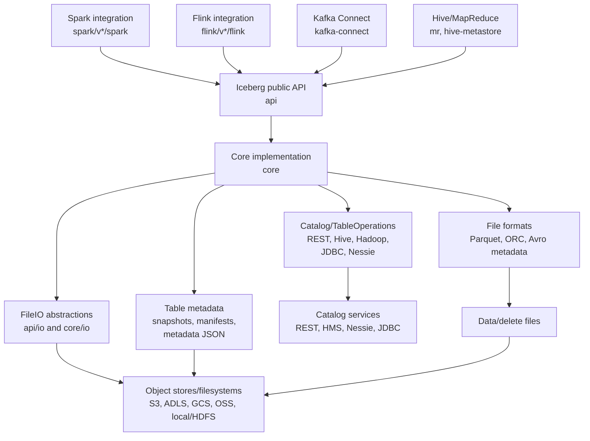
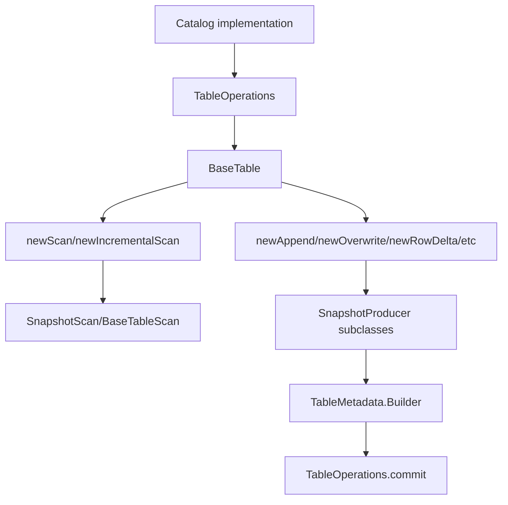
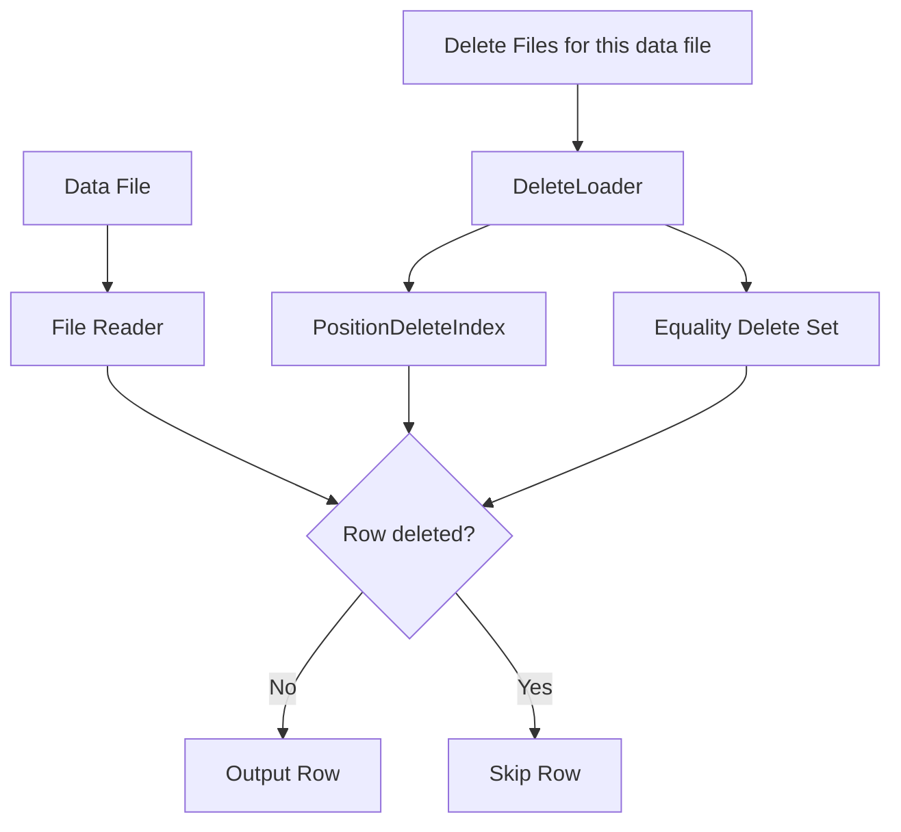
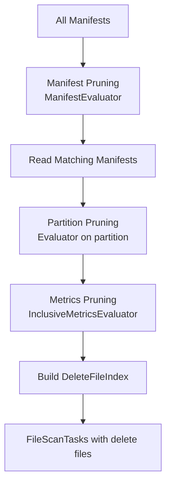
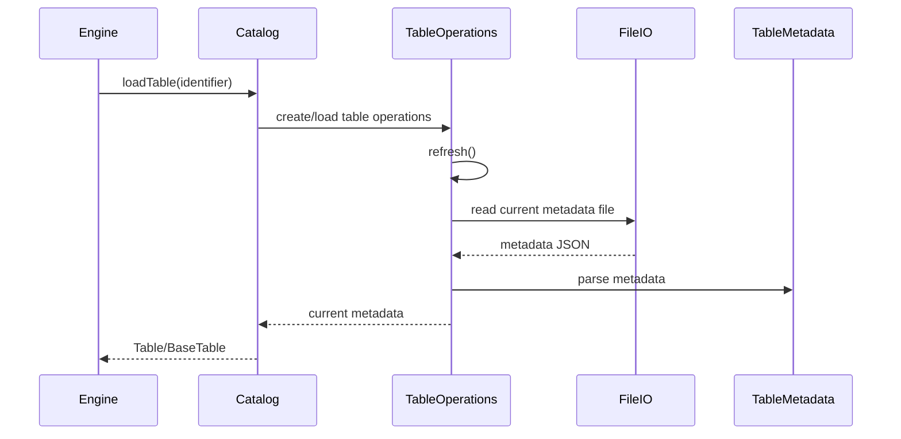
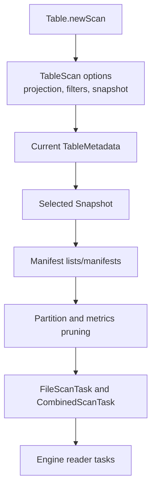
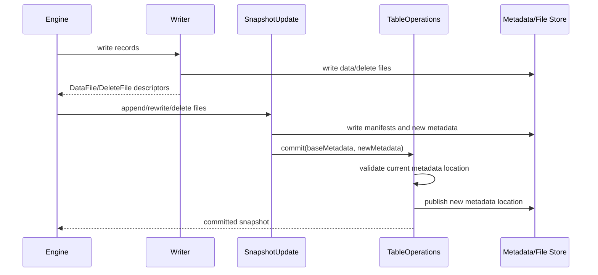
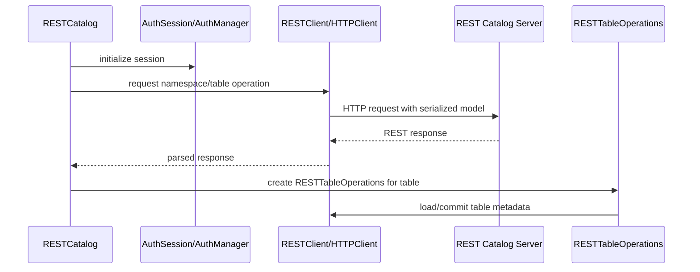
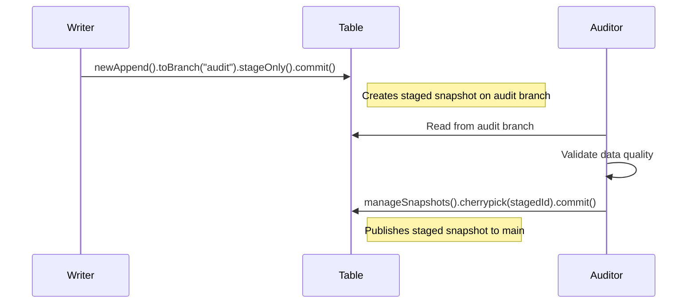

# Apache Iceberg Architecture Deep Dive

This document is a learning guide for engineers onboarding to this repository. It focuses on the Java reference implementation of Apache Iceberg and the major integration layers that adapt it to processing engines, catalogs, file formats, and object stores.

## 1. Executive Summary

Apache Iceberg is a table format for large analytic datasets. The core idea is that a table is described by immutable metadata files, snapshots, manifests, and data/delete files. Engines such as Spark, Flink, Hive, and Kafka Connect interact with those table abstractions through the Java API and delegate consistency, metadata evolution, scan planning, and commit behavior to Iceberg.

This repository is the Apache Iceberg Java monorepo. It contains the public API, the core implementation, file format integrations, catalog implementations, REST catalog support, engine adapters, cloud storage integrations, build tooling, and documentation/specification sources.

Most changes land in one of these areas:

- `api`: public contracts and stable domain interfaces.
- `core`: table metadata, snapshots, scan planning, commits, catalogs, REST support, and common implementations.
- `parquet`, `orc`, `arrow`, `data`: file reading/writing and JVM data model support.
- `spark`, `flink`, `mr`, `kafka-connect`: integration layers that adapt host engines to Iceberg.
- `aws`, `azure`, `gcp`, `aliyun`, `dell`, `snowflake`, `bigquery`, `nessie`, `hive-metastore`: backend, catalog, and platform-specific behavior.

The strongest mental model is a layered one: engines call Iceberg APIs, Iceberg core plans reads and commits metadata changes, catalogs coordinate table metadata locations, and storage/file-format modules read and write the actual files.

## 2. Monorepo Shape

The root Gradle build is defined in `settings.gradle` and `build.gradle`. `settings.gradle` declares the top-level projects and conditionally includes versioned Spark, Flink, and Kafka Connect modules based on Gradle properties. `build.gradle` centralizes Java compatibility, common dependencies, API compatibility checks, test behavior, and build plugins.

Module groups:

- Core libraries: `api`, `common`, `core`, `data`, `bundled-guava`, `bom`.
- File format and vectorization layers: `parquet`, `orc`, `arrow`.
- Catalog and metadata backends: `hive-metastore`, `nessie`, REST catalog code under `core/src/main/java/org/apache/iceberg/rest`, JDBC-related code under `core/src/main/java/org/apache/iceberg/jdbc`.
- Engine integrations: `spark`, `flink`, `mr`, `kafka-connect`.
- Cloud and vendor integrations: `aws`, `aws-bundle`, `azure`, `azure-bundle`, `gcp`, `gcp-bundle`, `aliyun`, `dell`, `snowflake`, `bigquery`, `delta-lake`.
- Specifications and user docs: `format`, `docs`, `site`, `open-api`.
- Build and project tooling: `gradle`, `project`, `.baseline`, `tasks.gradle`, `baseline.gradle`, `deploy.gradle`, `jmh.gradle`.

Versioned engine modules are important. Spark has `spark/v3.4`, `spark/v3.5`, and `spark/v4.0`. Flink has `flink/v1.20`, `flink/v2.0`, and `flink/v2.1`. These modules often duplicate structure because they compile against different engine APIs.

## 3. Architecture Overview



Architecturally, Iceberg separates table semantics from execution engines. The engine modules translate Spark/Flink/Hive/Kafka concepts into Iceberg scans, writes, row-level operations, and catalog calls. The core module owns the table-format behavior: metadata refresh, snapshot construction, manifest handling, scan planning, and optimistic commits.

The format specification in `format/spec.md` is the behavioral contract. Java classes in `api` and `core` are the reference implementation of that contract.

## 4. Core Domain Concepts

`Table` represents a logical Iceberg table. The public contract is `api/src/main/java/org/apache/iceberg/Table.java`; the common implementation is `core/src/main/java/org/apache/iceberg/BaseTable.java`. A table exposes schema, partitioning, sort order, snapshots, scans, and update builders.

`Schema` describes table columns, field IDs, and types. Schema-related types live under `api/src/main/java/org/apache/iceberg/types` and schema evolution logic appears in `core/src/main/java/org/apache/iceberg/schema`.

`PartitionSpec` describes how rows map into partition values. The public model is in `api/src/main/java/org/apache/iceberg/PartitionSpec.java` and related transform logic lives under `api/src/main/java/org/apache/iceberg/transforms`.

`SortOrder` describes logical ordering for writes and planning. The API-level classes live in `api/src/main/java/org/apache/iceberg`.

`Snapshot` represents a committed table state. Snapshots point to manifests and form table history. Public interfaces are in `api`; implementation and update machinery are in `core`, especially around `SnapshotProducer`.

`Manifest` files list data or delete files and their metadata. Manifest handling is implemented primarily in `core`, with Avro-based metadata file support under `core/src/main/java/org/apache/iceberg/avro`.

`DataFile` and `DeleteFile` describe physical files. Public models include `api/src/main/java/org/apache/iceberg/DataFile.java`, `api/src/main/java/org/apache/iceberg/DeleteFile.java`, and shared content interfaces.

`TableMetadata` is the serialized state of a table: current schema, partition specs, sort orders, snapshots, properties, refs, and metadata log. It is implemented in `core/src/main/java/org/apache/iceberg/TableMetadata.java`; JSON parsing is in `core/src/main/java/org/apache/iceberg/TableMetadataParser.java`.

`TableScan` plans reads. The public interface is `api/src/main/java/org/apache/iceberg/TableScan.java`; core planning implementation starts around `core/src/main/java/org/apache/iceberg/BaseTableScan.java` and related scan classes.

`Catalog` locates tables and namespaces. The public interface is `api/src/main/java/org/apache/iceberg/catalog/Catalog.java`. Catalog implementations construct or load `TableOperations`, which then manage metadata refresh and commit.

`TableOperations` is the core abstraction for loading current metadata and committing new metadata. It lives in `core/src/main/java/org/apache/iceberg/TableOperations.java`. Implementations include metastore-backed operations, REST-backed operations, Hadoop-style operations, and backend-specific variants.

## 4.1 Core Implementation Map

The most useful way to read `core` is to follow object ownership:



`BaseTable` is intentionally thin. It stores a `TableOperations`, a table name, and a metrics reporter. Its read methods, such as `schema()`, `spec()`, `currentSnapshot()`, and `properties()`, delegate to `ops.current()`. Its mutation methods are factories: `newAppend()` returns `MergeAppend`, `newFastAppend()` returns `FastAppend`, `newOverwrite()` returns `BaseOverwriteFiles`, `newRowDelta()` returns `BaseRowDelta`, `newRewrite()` returns `BaseRewriteFiles`, and so on.

`TableOperations` is the important state boundary. It exposes:

- `current()`: return loaded metadata without checking for updates.
- `refresh()`: reload current table metadata from the backend.
- `commit(base, metadata)`: atomically replace base metadata with new metadata.
- `io()`: return the `FileIO` used for table data and metadata files.
- `metadataFileLocation(fileName)`: choose where a new metadata file should be written.
- `locationProvider()`: choose locations for new data files.
- `newSnapshotId()`: allocate snapshot IDs.

The contract for `commit` is stricter than it first appears. Implementations must check that the supplied `base` is still current before publishing `metadata`. If the implementation cannot determine whether a commit succeeded, it must throw `CommitStateUnknownException`, because cleanup decisions depend on knowing whether newly written files are safe to delete.

`BaseMetastoreTableOperations` shows the common metastore-backed pattern. It caches `currentMetadata`, `currentMetadataLocation`, a metadata `version`, and a `shouldRefresh` flag. `current()` refreshes if needed. `commit(base, metadata)` rejects stale metadata, returns early for no-op commits, calls backend-specific `doCommit`, deletes removed metadata files, and marks the table for refresh. Subclasses provide `doRefresh()` and `doCommit()`.

## 4.2 Delete Files and Row-Level Operations

Iceberg V2 introduced delete files to support row-level deletes without rewriting data files. V3 adds deletion vectors (DVs) as a more efficient alternative to position deletes.

### Delete File Types

There are three types of delete files:

1. **Position Deletes**: Record file path + row position pairs. Applied by filtering out matching positions during scan.
2. **Equality Deletes**: Record column values that identify deleted rows. Applied by filtering rows matching the equality predicates.
3. **Deletion Vectors (V3)**: Compact bitmap representation of deleted positions within a single data file. Stored inline or as Puffin blobs.

Position deletes are cheaper to write but require the reader to know the exact file and position. Equality deletes are more expensive to apply but work without knowing positions.

### RowDelta API

`RowDelta` (`api/src/main/java/org/apache/iceberg/RowDelta.java`) is the primary API for row-level changes. It extends `SnapshotUpdate` and supports:

- `addRows(DataFile)`: Add a data file containing inserted rows.
- `addDeletes(DeleteFile)`: Add a delete file (position, equality, or DV).
- `removeRows(DataFile)`: Remove a data file (typically after merge-on-read compaction).
- `removeDeletes(DeleteFile)`: Remove a delete file that has been compacted away.

Validation methods ensure correctness for concurrent operations:

- `validateFromSnapshot(snapshotId)`: Set the snapshot ID that validations check against.
- `validateDataFilesExist(paths)`: Ensure referenced data files haven't been removed.
- `validateNoConflictingDataFiles()`: Ensure no concurrent data file additions conflict.
- `validateNoConflictingDeleteFiles()`: Ensure no concurrent delete file additions conflict (required for UPDATE/MERGE).
- `conflictDetectionFilter(expr)`: Scope conflict detection to rows matching the expression.

### Delete Application During Scan

When scanning a table with delete files:

1. `DeleteLoader` loads delete files relevant to each data file based on file path and sequence number.
2. For position deletes, `PositionDeleteIndex` (bitmap-based) tracks deleted positions.
3. For equality deletes, `StructLikeSet` holds the delete keys.
4. The reader applies deletes by checking each row against the delete index.



Key implementation files:

- `api/src/main/java/org/apache/iceberg/RowDelta.java`: Public API.
- `core/src/main/java/org/apache/iceberg/BaseRowDelta.java`: Implementation extending `MergingSnapshotProducer`.
- `core/src/main/java/org/apache/iceberg/deletes/Deletes.java`: Utility methods for building delete indexes and filtering.
- `core/src/main/java/org/apache/iceberg/deletes/PositionDeleteIndex.java`: Interface for position delete tracking.
- `core/src/main/java/org/apache/iceberg/deletes/BitmapPositionDeleteIndex.java`: Roaring bitmap implementation.

### Sequence Numbers and Delete Ordering

V2 introduced sequence numbers to order writes. A delete file only applies to data files with a lower sequence number. This allows:

- Concurrent writes without coordination.
- Correct ordering when delete files are written after data files.
- Late-arriving deletes that apply to older data.

The sequence number is assigned at commit time and stored in the manifest entry.

### Manifest Entry Structure

Each entry in a manifest file wraps a `DataFile` or `DeleteFile` with tracking metadata:

```java
// ManifestEntry fields (core/src/main/java/org/apache/iceberg/ManifestEntry.java)
interface ManifestEntry<F extends ContentFile<F>> {
  enum Status { EXISTING(0), ADDED(1), DELETED(2) }

  Status status();           // Entry state in this manifest
  Long snapshotId();         // Snapshot that added this file
  Long dataSequenceNumber(); // Sequence number for delete ordering
  Long fileSequenceNumber(); // Sequence number when file was added
  F file();                  // The actual DataFile or DeleteFile
}
```

The `status` field tracks file lifecycle:
- `ADDED`: File was added in this snapshot.
- `EXISTING`: File existed before and is carried forward.
- `DELETED`: File is marked for removal (tombstone).

Manifest merging compacts manifests by dropping `DELETED` entries and converting `ADDED` entries to `EXISTING` when rewriting.

### DataFile Field IDs and Metrics

`DataFile` (`api/src/main/java/org/apache/iceberg/DataFile.java`) stores extensive metadata for pruning:

| Field ID | Name | Purpose |
|----------|------|---------|
| 100 | file_path | File location URI |
| 101 | file_format | parquet/orc/avro |
| 102 | partition | Partition tuple values |
| 103 | record_count | Row count for planning |
| 104 | file_size_in_bytes | For cost estimation |
| 108 | column_sizes | Per-column bytes |
| 109 | value_counts | Non-null counts per column |
| 110 | null_value_counts | Null counts per column |
| 125 | lower_bounds | Min values per column |
| 128 | upper_bounds | Max values per column |
| 132 | split_offsets | Row group boundaries |
| 140 | sort_order_id | Clustering info |

These column-level statistics enable **metrics pruning**: skipping files where filter predicates cannot match based on min/max bounds.

### MergingSnapshotProducer Internals

Most write operations extend `MergingSnapshotProducer` (`core/src/main/java/org/apache/iceberg/MergingSnapshotProducer.java`), which provides:

**Manifest Management**:
- `ManifestMergeManager`: Combines small manifests to meet target size (`manifest.target-size-bytes`).
- `ManifestFilterManager`: Applies deletions and rewrites manifests.
- Separate managers for data files and delete files.

**File Tracking**:
```java
// New files added in this operation
private final Map<Integer, DataFileSet> newDataFilesBySpec;
private final Map<Integer, DeleteFileSet> newDeleteFilesBySpec;

// Files to delete
private Expression deleteExpression;  // Row filter for deletes

// Manifests to append
private final List<ManifestFile> appendManifests;
```

**Conflict Validation Operations**:
```java
// Validation checks in MergingSnapshotProducer
static final Set<String> VALIDATE_ADDED_FILES_OPERATIONS =
    ImmutableSet.of(DataOperations.APPEND, DataOperations.OVERWRITE);
static final Set<String> VALIDATE_DATA_FILES_EXIST_OPERATIONS =
    ImmutableSet.of(DataOperations.OVERWRITE, DataOperations.REPLACE, DataOperations.DELETE);
static final Set<String> VALIDATE_ADDED_DELETE_FILES_OPERATIONS =
    ImmutableSet.of(DataOperations.OVERWRITE, DataOperations.DELETE);
```

## 4.3 Expression System

Iceberg's expression system enables filter pushdown from engines to scan planning and file formats.

### Expression Types

All expressions are in `api/src/main/java/org/apache/iceberg/expressions/`:

| Type | Example | Use Case |
|------|---------|----------|
| `And` / `Or` / `Not` | `and(eq("a", 1), gt("b", 2))` | Combining predicates |
| `UnboundPredicate` | `equal("col", value)` | Before binding to schema |
| `BoundPredicate` | After `bind(schema)` | Ready for evaluation |
| `UnboundTerm` | `bucket("id", 16)` | Transform expressions |

**Expression Lifecycle**:
```
Unbound Expression → bind(schema) → Bound Expression → evaluate(row)
```

### Projections and Residuals

`Projections` transforms row-level expressions into partition-level expressions:

```java
// Example: row filter "date = '2024-01-15'" on table partitioned by day(timestamp)
Expression rowFilter = Expressions.equal("date", "2024-01-15");

// Project to partition filter
Expression partitionFilter = Projections.inclusive(spec).project(rowFilter);
// Result: day(timestamp) = days_since_epoch("2024-01-15")
```

**Inclusive vs Strict Projections**:
- `Projections.inclusive()`: May include extra rows (for partition pruning).
- `Projections.strict()`: Only matches if all rows match (for file metrics pruning).

**ResidualEvaluator**: After partition pruning, computes the remaining predicate to apply at read time.

### ManifestEvaluator

`ManifestEvaluator` decides whether a manifest might contain matching files:

```java
ManifestEvaluator evaluator = ManifestEvaluator.forRowFilter(
    rowFilter, spec, caseSensitive);

for (ManifestFile manifest : snapshot.manifests()) {
  if (evaluator.eval(manifest)) {
    // Manifest might have matching files, must scan it
  } else {
    // Skip entire manifest
  }
}
```

Uses manifest-level partition summaries (min/max per partition field across all entries).

## 4.4 Scan Planning Internals

The scan planner transforms a filter expression into a set of file tasks.

### ManifestGroup

`ManifestGroup` (`core/src/main/java/org/apache/iceberg/ManifestGroup.java`) orchestrates scan planning:



**ManifestGroup Configuration**:
```java
ManifestGroup group = new ManifestGroup(io, dataManifests, deleteManifests)
    .specsById(specsById)
    .filterData(rowFilter)              // Row-level filter
    .filterPartitions(partitionFilter)  // Partition-level filter
    .caseSensitive(true)
    .planWith(executorService);         // Parallel manifest reading
```

### DeleteFileIndex

`DeleteFileIndex` (`core/src/main/java/org/apache/iceberg/DeleteFileIndex.java`) maps data files to applicable delete files:

```java
class DeleteFileIndex {
  // Global equality deletes (apply to all partitions)
  private final EqualityDeletes globalDeletes;

  // Equality deletes by partition
  private final PartitionMap<EqualityDeletes> eqDeletesByPartition;

  // Position deletes by partition
  private final PartitionMap<PositionDeletes> posDeletesByPartition;

  // Position deletes by exact file path (for DVs)
  private final Map<String, PositionDeletes> posDeletesByPath;

  // Deletion vectors by data file path
  private final Map<String, DeleteFile> dvByPath;
}
```

**Delete Matching Algorithm**:
1. Find equality deletes that apply (global + partition-scoped, sequence number check).
2. Find position deletes that apply (partition-scoped, sequence number check).
3. Find DVs that reference this data file path.
4. Return combined delete files for the reader to apply.

### Incremental Scans

`IncrementalDataTableScan` (`core/src/main/java/org/apache/iceberg/IncrementalDataTableScan.java`) reads only new data between snapshots:

```java
// Read data added between two snapshots
table.newScan()
    .appendsBetween(fromSnapshotId, toSnapshotId)
    .planFiles();

// Read data added after a snapshot
table.newScan()
    .appendsAfter(fromSnapshotId)
    .planFiles();
```

This enables CDC-style streaming: track last processed snapshot, read only new appends.

**Implementation**: Walks snapshot history from `fromSnapshot` to `toSnapshot`, collects manifests from `APPEND` operations, filters to `ADDED` entries only.

## 4.5 Conflict Detection and Validation

Concurrent write correctness depends on validation at commit time.

### Isolation Levels

Iceberg supports two isolation levels configured per operation:

| Level | Behavior | Use Case |
|-------|----------|----------|
| `SNAPSHOT` | Validate against read snapshot | Default for most operations |
| `SERIALIZABLE` | Validate against all concurrent changes | Required for UPDATE/MERGE correctness |

### Validation Methods

`BaseRowDelta` shows the validation pattern:

```java
@Override
protected void validate(TableMetadata base, Snapshot parent) {
  if (parent != null) {
    // 1. Validate starting snapshot is ancestor
    if (startingSnapshotId != null) {
      Preconditions.checkArgument(
          SnapshotUtil.isAncestorOf(parent.snapshotId(), startingSnapshotId, base::snapshot));
    }

    // 2. Validate referenced data files still exist
    if (!referencedDataFiles.isEmpty()) {
      validateDataFilesExist(base, startingSnapshotId, referencedDataFiles, ...);
    }

    // 3. Validate no conflicting data files added
    if (validateNewDataFiles) {
      validateAddedDataFiles(base, startingSnapshotId, conflictDetectionFilter, parent);
    }

    // 4. Validate no conflicting delete files added
    if (validateNewDeleteFiles) {
      validateNoNewDeleteFiles(base, startingSnapshotId, conflictDetectionFilter, parent);
    }

    // 5. Validate DVs don't conflict
    validateAddedDVs(base, startingSnapshotId, conflictDetectionFilter, parent);
  }
}
```

### Conflict Detection Filter

The conflict detection filter scopes validation to relevant rows:

```java
// Only validate conflicts for rows matching this filter
rowDelta
    .conflictDetectionFilter(Expressions.equal("region", "us-west"))
    .validateNoConflictingDataFiles()
    .validateNoConflictingDeleteFiles();
```

Files are checked for conflicts only if their partition statistics might overlap with the filter. This allows concurrent operations on different partitions.

## 4.6 Transaction Support

`Transaction` (`api/src/main/java/org/apache/iceberg/Transaction.java`) groups multiple operations into a single atomic commit:

```java
Transaction txn = table.newTransaction();

// Multiple operations share the transaction
txn.updateSchema()
    .addColumn("new_col", Types.StringType.get())
    .commit();

txn.newAppend()
    .appendFile(dataFile)
    .commit();

txn.updateProperties()
    .set("key", "value")
    .commit();

// Single atomic commit of all changes
txn.commitTransaction();
```

**Implementation** (`core/src/main/java/org/apache/iceberg/BaseTransaction.java`):
- Creates a `TransactionTable` that buffers operations.
- Each operation updates an in-memory `TableMetadata`.
- `commitTransaction()` writes final metadata and commits atomically.
- Validates that base metadata hasn't changed since transaction start.

**Transaction Types**:
- `CREATE_TABLE`: Create new table with initial metadata.
- `REPLACE_TABLE`: Replace table atomically.
- `CREATE_OR_REPLACE`: Create or replace as atomic unit.
- `SIMPLE`: Default for multi-operation transactions.

## 5. Deep Dive By Major Module

### `api`

`api` contains public interfaces and value types that engines and applications depend on. It should remain stable and carefully versioned. Important packages include:

- `org.apache.iceberg`: table, scan, snapshot, schema, partition, file, transaction, and update contracts.
- `org.apache.iceberg.catalog`: catalog and namespace contracts.
- `org.apache.iceberg.expressions`: filter expressions and binding/evaluation abstractions.
- `org.apache.iceberg.io`: `FileIO`, `InputFile`, `OutputFile`, and related IO contracts.
- `org.apache.iceberg.metrics`, `events`, `encryption`, `view`, `variants`: public extension surfaces.

Start with `Table.java`, `TableScan.java`, `Catalog.java`, `FileIO.java`, and the update interfaces such as `AppendFiles`, `RewriteFiles`, `DeleteFiles`, and `Transaction`.

### `common`

`common` holds shared utilities used by other modules. Treat it as low-level support code. Changes here can have wide blast radius because many modules depend on it.

### `core`

`core` is the reference implementation of the table format. It implements table loading, metadata parsing, snapshot updates, manifest handling, scan planning, catalog clients, REST support, metrics reporting, delete handling, and utility implementations.

Key files and packages:

- `BaseTable.java`: concrete `Table` implementation.
- `TableOperations.java`: refresh and commit abstraction.
- `TableMetadata.java` and `TableMetadataParser.java`: table state and JSON serialization.
- `SnapshotProducer.java`: base machinery for snapshot-producing updates.
- `BaseMetastoreTableOperations.java`: shared behavior for metastore-backed commit implementations.
- `BaseTableScan.java` and `SnapshotScan.java`: scan planning implementation.
- `core/src/main/java/org/apache/iceberg/rest`: REST catalog client, request/response models, auth, retry, and serialization.
- `core/src/main/java/org/apache/iceberg/io`: IO helpers and implementations.
- `core/src/main/java/org/apache/iceberg/deletes`: delete file planning/application support.
- `core/src/main/java/org/apache/iceberg/puffin`: Puffin metadata file support.

`core` is the best place to study Iceberg behavior independent of any one engine.

### `data`

`data` provides generic JVM record and reader/writer utilities for direct Java use. It bridges Iceberg schemas to generic records and format readers/writers. Look at `data/src/main/java/org/apache/iceberg/data` when working on non-engine-specific row handling.

### `parquet`, `orc`, and `arrow`

`parquet` and `orc` implement file format integration: schema conversion, readers, writers, metrics, filters, vectorization hooks, and type visitors. `arrow` provides Arrow vector and columnar batch support, especially for vectorized reads.

Representative files:

- `parquet/src/main/java/org/apache/iceberg/parquet/Parquet.java`
- `parquet/src/main/java/org/apache/iceberg/parquet/ParquetReader.java`
- `parquet/src/main/java/org/apache/iceberg/parquet/ParquetWriter.java`
- `parquet/src/main/java/org/apache/iceberg/parquet/ParquetSchemaUtil.java`
- `arrow/src/main/java/org/apache/iceberg/arrow/vectorized/VectorizedReaderBuilder.java`

These modules depend on Iceberg schemas and expressions but should not own table commit semantics.

### Catalog and Backend Modules

`hive-metastore` integrates with the Hive metastore. `nessie` integrates with Project Nessie. JDBC and REST catalog code are largely under `core`. Cloud modules provide storage clients, `FileIO` implementations, credential handling, and backend-specific configuration.

REST catalog support is central enough to read separately:

- `core/src/main/java/org/apache/iceberg/rest/RESTCatalog.java`
- `core/src/main/java/org/apache/iceberg/rest/RESTTableOperations.java`
- `core/src/main/java/org/apache/iceberg/rest/RESTClient.java`
- `core/src/main/java/org/apache/iceberg/rest/HTTPClient.java`
- `core/src/main/java/org/apache/iceberg/rest/auth`
- `core/src/main/java/org/apache/iceberg/rest/requests`
- `core/src/main/java/org/apache/iceberg/rest/responses`

The REST OpenAPI/spec artifacts live under `open-api` and `site/docs/rest-catalog-spec.md`.

### `spark`

Spark integration adapts Spark DataSource V2, Spark SQL extensions, Spark catalog APIs, Spark rows, and Spark columnar execution to Iceberg. Versioned modules exist because Spark APIs differ by version and Scala binary version.

Representative Spark 3.5 files:

- `spark/v3.5/spark/src/main/java/org/apache/iceberg/spark/SparkCatalog.java`
- `spark/v3.5/spark/src/main/java/org/apache/iceberg/spark/source/SparkTable.java`
- `spark/v3.5/spark/src/main/java/org/apache/iceberg/spark/source/SparkScanBuilder.java`
- `spark/v3.5/spark/src/main/java/org/apache/iceberg/spark/source/SparkWriteBuilder.java`
- `spark/v3.5/spark/src/main/java/org/apache/iceberg/spark/source/SparkWrite.java`
- `spark/v3.5/spark/src/main/java/org/apache/iceberg/spark/procedures`

Spark-specific code should translate Spark concepts into Iceberg operations and delegate actual table semantics to `api` and `core`.

### `flink`

Flink integration adapts Flink table factories, catalogs, sources, sinks, streaming commits, dynamic sinks, and maintenance jobs.

Representative Flink 1.20 files:

- `flink/v1.20/flink/src/main/java/org/apache/iceberg/flink/FlinkCatalog.java`
- `flink/v1.20/flink/src/main/java/org/apache/iceberg/flink/FlinkDynamicTableFactory.java`
- `flink/v1.20/flink/src/main/java/org/apache/iceberg/flink/TableLoader.java`
- `flink/v1.20/flink/src/main/java/org/apache/iceberg/flink/sink/FlinkSink.java`
- `flink/v1.20/flink/src/main/java/org/apache/iceberg/flink/sink/IcebergStreamWriter.java`
- `flink/v1.20/flink/src/main/java/org/apache/iceberg/flink/sink/IcebergFilesCommitter.java`
- `flink/v1.20/flink/src/main/java/org/apache/iceberg/flink/maintenance`

Flink has more explicit streaming and checkpoint-driven commit concerns than batch-first engine paths.

### `mr`, `hive-metastore`, and Hive-facing Code

`mr` contains MapReduce/Hive input/output integration. `hive-metastore` implements Hive metastore catalog/operations support. This path matters for compatibility with Hive ecosystems and metastore-backed table location tracking.

### `kafka-connect`

Kafka Connect implements a sink connector that writes Kafka records to Iceberg tables and coordinates commits.

Representative files:

- `kafka-connect/kafka-connect/src/main/java/org/apache/iceberg/connect/IcebergSinkConnector.java`
- `kafka-connect/kafka-connect/src/main/java/org/apache/iceberg/connect/IcebergSinkTask.java`
- `kafka-connect/kafka-connect/src/main/java/org/apache/iceberg/connect/Committer.java`
- `kafka-connect/kafka-connect/src/main/java/org/apache/iceberg/connect/data/IcebergWriter.java`
- `kafka-connect/kafka-connect/src/main/java/org/apache/iceberg/connect/channel/Coordinator.java`
- `kafka-connect/kafka-connect/src/main/java/org/apache/iceberg/connect/channel/CommitterImpl.java`

The connector owns Kafka-specific lifecycle and offset handling, while Iceberg core owns table commits.

### Cloud and Vendor Modules

Cloud modules add platform-specific `FileIO`, configuration, credential, and service integrations. They should generally plug into public IO/catalog abstractions rather than changing table semantics.

- `aws` and `aws-bundle`: S3, AWS clients, bundled runtime artifact.
- `azure` and `azure-bundle`: Azure storage integrations.
- `gcp` and `gcp-bundle`: Google Cloud storage integrations.
- `aliyun`, `dell`, `snowflake`, `bigquery`: vendor-specific integration points.

## 6. Critical Runtime Flows

### Table Load Flow



An engine or application asks a `Catalog` for a table. The catalog creates backend-specific `TableOperations`, refreshes the current metadata location, reads and parses `TableMetadata`, then returns a `Table` implementation. The exact source of the metadata location depends on the catalog: Hive metastore, REST service, Hadoop location, Nessie, JDBC, or another backend.

### Scan Planning Flow



A scan starts from `TableScan`, usually implemented through `BaseTableScan` and `SnapshotScan`. Filters and projections are bound to the table schema. Iceberg chooses a snapshot, reads manifests, prunes files using partition and metrics information, and produces scan tasks. Engine modules convert those tasks into Spark partitions, Flink splits, MapReduce splits, or connector-specific work.

Implementation detail:

- `BaseTable.newScan()` creates a `DataTableScan` with the table schema and an immutable scan context.
- `SnapshotScan.planFiles()` resolves the target snapshot. Without an explicit snapshot ID, it uses `table().currentSnapshot()`.
- Time travel is handled by `useSnapshot`, `useRef`, and `asOfTime`. These refine the scan context instead of mutating the original scan.
- `SnapshotScan.planFiles()` emits a `ScanEvent`, starts scan metrics, calls `doPlanFiles()`, and reports a `ScanReport` when the returned iterable is closed.
- `BaseTableScan.planTasks()` splits `FileScanTask`s using `TableScanUtil.splitFiles` and combines them using `TableScanUtil.planTasks`.
- Concrete scan classes own manifest reading and data/delete file task production. The base classes own lifecycle, context, metrics, and snapshot selection.

The key distinction is `planFiles()` versus `planTasks()`. `planFiles()` produces file-level work. `planTasks()` turns that work into combined tasks sized for execution, using target split size, split lookback, and open-file cost.

### Write and Commit Flow



Writers produce physical data/delete files first. Snapshot updates then create manifests and a new metadata file. `TableOperations.commit` attempts to atomically swap the table from the base metadata to the new metadata. If another writer committed first, validation or commit conflict handling determines whether to retry or fail.

The common snapshot-producing path is implemented by `SnapshotProducer`:

1. The operation captures `ops.current()` as its base metadata.
2. `commit()` runs with retry settings from table properties such as `commit.num-retries`, `commit.min-retry-wait-ms`, `commit.max-retry-wait-ms`, and `commit.total-retry-time-ms`.
3. Each attempt calls `apply()`.
4. `apply()` refreshes metadata, finds the parent snapshot for the target branch, validates the current table state, and asks the subclass to produce manifest files through `apply(base, parentSnapshot)`.
5. `SnapshotProducer` writes a manifest list file, builds a `BaseSnapshot`, and prepares snapshot summary totals.
6. `commit()` builds updated `TableMetadata` from the refreshed base. It either adds a staged snapshot or sets the target branch snapshot.
7. `TableOperations.commit(base, updated.withUUID())` publishes the metadata.
8. After success, uncommitted manifests and extra manifest lists from failed attempts are cleaned up.
9. Listeners and metrics reporters are notified after the commit.

Different update classes customize the operation by implementing `operation()`, `validate(...)`, `apply(...)`, `summary()`, and cleanup. For example, append, overwrite, row delta, rewrite, and replace-partitions operations share the same outer commit lifecycle but differ in validation and manifest construction.

### REST Catalog Flow



REST code handles request/response models, auth, retry, error mapping, and serialization. The client-side catalog still returns Iceberg `Table` abstractions; REST primarily changes how metadata is loaded and committed.

`RESTTableOperations` implements the same `TableOperations` contract but sends metadata changes to a REST server:

- `refresh()` checks the `V1_LOAD_TABLE` endpoint and fetches a `LoadTableResponse`.
- `commit(base, metadata)` checks `V1_UPDATE_TABLE`, derives `MetadataUpdate` entries from `metadata.changes()`, and derives `UpdateRequirement`s from the update type.
- Create, replace, and simple updates use different requirement builders: `forCreateTable`, `forReplaceTable`, and `forUpdateTable`.
- The request is serialized as `UpdateTableRequest` and posted through `RESTClient`.
- The response updates the local current metadata.
- On `CommitStateUnknownException`, simple snapshot-add-only updates attempt lightweight reconciliation by refreshing and checking whether the expected snapshot exists.

This is a useful contrast with metastore operations. Metastore implementations usually write a metadata file then atomically update a metadata location in the backing catalog. REST operations send logical metadata updates and requirements to a server that owns the final commit decision.

## 7. Catalog and Metadata Layer

`Catalog` is the user-facing namespace/table registry abstraction. `Table` is the logical table API. `TableOperations` is the internal implementation boundary that loads current metadata and commits replacements.

The normal relationship is:

- A catalog receives a table identifier.
- The catalog creates a backend-specific `TableOperations`.
- `TableOperations.refresh()` loads the current `TableMetadata`.
- The catalog wraps operations in `BaseTable`.
- Updates call back into `TableOperations.commit(base, updated)`.

`TableMetadata` is immutable table state. A commit creates a replacement metadata object and writes it as a new metadata file. The catalog/metastore then publishes the new metadata location if the base state is still current.

The optimistic concurrency model is visible in the shape of `TableOperations.commit(base, metadata)`: writers build changes from a known base and commit only if the backend can atomically replace that base. Specific backends implement the atomicity differently. Metastore-backed operations use metastore state; REST operations call the REST service; Hadoop-style operations use filesystem conventions.

REST-backed operations differ because table metadata load and commit travel through serialized REST request/response models. Auth and TLS behavior live under `core/src/main/java/org/apache/iceberg/rest/auth`; request and response types live under `rest/requests` and `rest/responses`; HTTP retry/error behavior is in the REST client classes.

### Metadata Commit Mechanics

For metastore-backed implementations, the usual commit shape is:

1. Validate that the caller's base metadata object is still the current metadata object.
2. Write the new table metadata JSON to a unique file under the table metadata location.
3. Atomically update the backend's pointer from the old metadata location to the new metadata location.
4. Mark local state as needing refresh.
5. Clean up old metadata files according to table properties and cleanup rules.

`BaseMetastoreTableOperations.writeNewMetadata()` writes through `TableMetadataParser.overwrite`. The comment in that method explains why overwrite is used for a unique metadata path: it avoids negative caching problems in S3 while remaining safe because metadata filenames include unique UUID material.

The table UUID check in `refreshFromMetadataLocation` prevents accidentally refreshing one table object with another table's metadata. If both old and new metadata have UUIDs, they must match.

### Snapshot Update Mechanics

Most table-modifying operations eventually produce `MetadataUpdate` entries. Those entries describe logical changes to table metadata: adding schemas, setting current schema, adding snapshots, setting refs, updating properties, and similar changes. REST commits transmit these updates directly. Local/metastore commits materialize a replacement `TableMetadata` object and publish its file location.

Branch handling is built into `SnapshotProducer`. The default target is `main`. `toBranch` changes the target branch, and `stageOnly` adds the snapshot without advancing the branch head. Write-audit-publish in Spark uses this staged snapshot behavior.

## 7.1 Branching and Tagging

Iceberg supports named references to snapshots through branches and tags. This enables workflows like write-audit-publish (WAP), isolated development branches, and point-in-time recovery.

### SnapshotRef Structure

`SnapshotRef` (`api/src/main/java/org/apache/iceberg/SnapshotRef.java`) represents a named reference to a snapshot:

```java
public class SnapshotRef {
  private final long snapshotId;          // The snapshot this ref points to
  private final SnapshotRefType type;     // BRANCH or TAG
  private final Integer minSnapshotsToKeep; // Branch retention: minimum snapshots
  private final Long maxSnapshotAgeMs;    // Branch retention: max age
  private final Long maxRefAgeMs;         // Reference retention: when to expire the ref itself
}
```

**Branches** are mutable pointers that advance as new snapshots are committed. They support retention policies for automatic snapshot expiration.

**Tags** are immutable pointers to a specific snapshot. They do not advance and cannot have snapshot retention properties (only ref age).

The `main` branch (`SnapshotRef.MAIN_BRANCH`) is the default branch. All tables have a `main` branch that points to the current snapshot.

### ManageSnapshots API

`ManageSnapshots` (`api/src/main/java/org/apache/iceberg/ManageSnapshots.java`) provides the API for managing refs:

```java
// Create refs
table.manageSnapshots()
    .createBranch("audit-branch", snapshotId)
    .createTag("release-v1", snapshotId)
    .commit();

// Modify refs
table.manageSnapshots()
    .replaceBranch("main", "audit-branch")  // Fast-forward main to audit-branch
    .setMinSnapshotsToKeep("main", 10)
    .setMaxSnapshotAgeMs("main", 7 * 24 * 60 * 60 * 1000L)  // 7 days
    .commit();

// Remove refs
table.manageSnapshots()
    .removeBranch("old-branch")
    .removeTag("old-tag")
    .commit();
```

Key operations:

- `createBranch(name)` / `createBranch(name, snapshotId)`: Create a new branch.
- `createTag(name, snapshotId)`: Create a new tag.
- `removeBranch(name)` / `removeTag(name)`: Remove a ref.
- `replaceBranch(from, to)`: Point branch `from` to the same snapshot as `to`.
- `fastForwardBranch(from, to)`: Fast-forward `from` to `to` (requires `from` is ancestor).
- `cherrypick(snapshotId)`: Apply changes from a staged snapshot to the current branch.

### Write-Audit-Publish (WAP) Pattern

WAP allows writing data to a staged snapshot that is not visible until audited and published:



The workflow:

1. Write data with `stageOnly()` to create an orphan snapshot.
2. Use `toBranch("wap-branch")` to write to a non-main branch.
3. Audit the staged data by reading from that branch.
4. Use `cherrypick(snapshotId)` to publish the staged snapshot to `main`.

### Time Travel with Refs

Scans can target specific refs:

```java
// Read from a branch
table.newScan().useRef("feature-branch").planFiles();

// Read from a tag
table.newScan().useRef("release-v1").planFiles();

// Read from a specific snapshot
table.newScan().useSnapshot(snapshotId).planFiles();

// Read as of a timestamp
table.newScan().asOfTime(timestampMillis).planFiles();
```

Key implementation files:

- `api/src/main/java/org/apache/iceberg/SnapshotRef.java`: Ref model.
- `api/src/main/java/org/apache/iceberg/ManageSnapshots.java`: Public API.
- `core/src/main/java/org/apache/iceberg/SnapshotManager.java`: Implementation.
- `core/src/main/java/org/apache/iceberg/TableMetadata.java`: Stores refs map.

## 8. Engine Integration Strategy

Engine modules are adapters, not owners of table semantics. They translate engine-specific APIs into Iceberg table operations.

Spark integration maps Spark catalogs, DataSource V2 scans, writes, row-level operations, SQL procedures, Spark expressions, and Spark row/columnar data into Iceberg calls. It delegates metadata and commit behavior to `core`.

Flink integration maps Flink table factories, catalogs, sources, sinks, checkpoint-aware committers, and maintenance operations into Iceberg. Streaming writes require Flink-specific coordination around checkpoints and committables, but final table commit still uses Iceberg update/commit APIs.

MapReduce/Hive code provides older Hadoop ecosystem integration and often interacts with Hive metastore behavior.

Kafka Connect owns Kafka connector lifecycle, task coordination, record conversion, offsets, and commit coordination. It writes Iceberg files and uses Iceberg commits to publish table changes.

Versioned Spark and Flink modules should be read as parallel implementations against different host API versions. When changing shared behavior, check the same class families across versions.

### Spark Write Path Details

Spark 3.5 write behavior is centered on `spark/v3.5/spark/src/main/java/org/apache/iceberg/spark/source/SparkWrite.java`.

`SparkWrite` implements Spark's `Write` and `RequiresDistributionAndOrdering`. It computes the required distribution, ordering, advisory partition size, data file format, output partition spec, target data file size, write schema, and snapshot metadata from `SparkWriteConf` and `SparkWriteRequirements`.

The executor-facing writer factory broadcasts a serializable copy of the Iceberg table:

- `createWriterFactory()` broadcasts `SerializableTableWithSize.copyOf(table)`.
- Each Spark task writes records into Iceberg `DataFile`s through a `DataWriter`.
- Task outputs are returned as `TaskCommit` messages.
- Driver-side commit code converts those messages into `DataFileSet`s and commits through Iceberg table update APIs.

Spark write modes map to Iceberg operations:

- Batch append: `table.newAppend()`, then `append.appendFile(file)`.
- Dynamic overwrite: `table.newReplacePartitions()`, with optional conflict validation.
- Overwrite by filter: `table.newOverwrite().overwriteByRowFilter(expr)`.
- Copy-on-write row-level operations: `table.newOverwrite()`, delete overwritten files, add replacement files, and validate conflicts according to `SERIALIZABLE` or `SNAPSHOT` isolation.
- Streaming append: `table.newFastAppend()`, with query ID and epoch ID written into snapshot summary metadata.
- Streaming complete overwrite: overwrite semantics with epoch tracking.

`commitOperation` is the common driver-side commit wrapper. It adds Spark app ID, extra snapshot metadata, thread-local commit properties, WAP metadata, and branch targeting before calling `operation.commit()`. If a commit fails with a cleanable failure, abort cleanup deletes files produced by the job.

Spark streaming idempotency is snapshot-summary based. Before committing an epoch, `BaseStreamingWrite.commit` refreshes the table and walks snapshot ancestors looking for the same query ID. If it finds a committed epoch greater than or equal to the current one, it skips the commit.

### Flink Sink Path Details

Flink streaming writes split responsibility between writers and a committer:

- `IcebergStreamWriter` is a stream operator that owns a `TaskWriter`.
- On each record, `processElement` calls `writer.write`.
- On checkpoint barrier, `prepareSnapshotPreBarrier` calls `flush(checkpointId)`.
- `flush` completes the current writer, emits a `FlinkWriteResult`, and creates a fresh writer.
- `IcebergFilesCommitter` receives those results, stores them by checkpoint, and commits when Flink reports checkpoint completion.

`IcebergFilesCommitter` maintains a sorted map from checkpoint ID to serialized delta manifests. This is important for fault tolerance: if checkpoint 1 writes files but its snapshot fails, and checkpoint 2 later succeeds, the committer can commit all pending files up to checkpoint 2. It stores this pending state in Flink operator state.

On restore, the committer reloads the table through `TableLoader`, restores the previous Flink job ID from state, finds the max committed checkpoint ID from Iceberg snapshot metadata, and commits any restored uncommitted files whose checkpoint ID is newer.

Commit behavior depends on mode:

- Replace-partitions mode creates a `ReplacePartitions` operation.
- Normal delta mode creates append/row-delta style updates depending on the pending write results.
- Empty checkpoints are skipped until `flink.max-continuous-empty-commits` is reached, which bounds metadata heartbeat behavior.

Flink's correctness boundary is therefore two-layered: Flink checkpoint state preserves pending files, and Iceberg snapshot metadata records max committed checkpoint information to avoid duplicate commits after recovery.

## 9. Storage, File Formats, and IO

Iceberg separates logical table metadata from physical file access. `FileIO`, `InputFile`, and `OutputFile` are public IO abstractions in `api/src/main/java/org/apache/iceberg/io`. Cloud modules and Hadoop/local implementations provide concrete access to object stores or filesystems.

File format modules handle data-file concerns:

- `parquet`: Parquet schema conversion, readers, writers, filter pushdown, row group metrics, vectorized reading.
- `orc`: ORC schema conversion, readers, writers, and vectorization paths.
- `arrow`: Arrow vectors and batch abstractions used by vectorized readers and engine integration.

Metadata files use Iceberg-specific JSON and Avro structures. Table metadata JSON is handled by `TableMetadataParser`; manifests and manifest lists are handled in core metadata/Avro code. Data files and delete files are stored in Parquet/ORC/Avro depending on table configuration and writer path.

### Parquet Integration Details

The `parquet` module provides deep integration with Apache Parquet:

**Schema Conversion** (`parquet/src/main/java/org/apache/iceberg/parquet/ParquetSchemaUtil.java`):
```java
// Iceberg schema → Parquet MessageType
MessageType parquetSchema = ParquetSchemaUtil.convert(icebergSchema, "table");

// Parquet → Iceberg (for schema inference)
Schema icebergSchema = ParquetSchemaUtil.convert(parquetSchema);
```

**Filter Pushdown** (`parquet/src/main/java/org/apache/iceberg/parquet/ParquetFilters.java`):
Iceberg expressions are converted to Parquet `FilterPredicate`:
```java
FilterPredicate parquetFilter = ParquetFilters.convert(
    schema, expression, caseSensitive);
```

Parquet then uses these predicates for:
- Row group skipping (using column statistics)
- Page skipping (using page indexes, if available)
- Dictionary filtering

**Vectorized Reading** (`parquet/src/main/java/org/apache/iceberg/parquet/VectorizedParquetReader.java`):
For engine integration, Iceberg provides vectorized batch readers that work with columnar formats:
```java
CloseableIterable<ColumnarBatch> reader = Parquet.read(inputFile)
    .project(schema)
    .filter(filter)
    .createBatchedReaderFunc(fileSchema ->
        VectorizedSparkParquetReaders.buildReader(schema, fileSchema, ...))
    .build();
```

**Metrics Collection**:
When writing Parquet files, Iceberg collects column-level metrics:
- Min/max values per column (for metrics pruning)
- Null counts
- Value counts
- Column sizes

### ORC Integration

ORC integration follows a similar pattern:

**Schema Conversion** (`orc/src/main/java/org/apache/iceberg/orc/ORCSchemaUtil.java`):
```java
TypeDescription orcSchema = ORCSchemaUtil.convert(icebergSchema);
Schema icebergSchema = ORCSchemaUtil.convert(orcSchema);
```

**Filter Pushdown**: ORC supports search arguments (SArg) for predicate pushdown:
```java
SearchArgument sarg = OrcFilters.convert(expression, schema);
```

**Vectorized Reading**: ORC has native vectorized batch support through `VectorizedRowBatch`.

### Reader and Writer Factory Pattern

Iceberg uses a factory pattern for format-agnostic reading and writing:

**Reading** (`data/src/main/java/org/apache/iceberg/data/`):
```java
CloseableIterable<Record> reader = IcebergGenerics.read(table)
    .where(filter)
    .select(columns)
    .build();
```

Internally, this uses format-specific readers:
```java
// For Parquet
Parquet.read(file)
    .project(schema)
    .filter(residual)
    .createReaderFunc(fileSchema -> GenericParquetReaders.buildReader(schema, fileSchema))
    .build();

// For ORC
ORC.read(file)
    .project(schema)
    .filter(residual)
    .createReaderFunc(fileSchema -> GenericOrcReaders.buildReader(schema, fileSchema))
    .build();
```

**Writing** (`data/src/main/java/org/apache/iceberg/data/`):
```java
FileAppender<Record> appender = Parquet.write(outputFile)
    .schema(schema)
    .createWriterFunc(GenericParquetWriter::buildWriter)
    .build();

for (Record record : records) {
    appender.add(record);
}
appender.close();
```

### Delete File Formats

Position delete files use a fixed schema:
```
file_path: string (required)
pos: long (required)
row: struct (optional, for debugging)
```

Equality delete files use a subset of the table schema containing only the equality field columns.

### File Creation and Location Responsibilities

`TableOperations.locationProvider()` supplies data file locations. Writers generally do not invent table layout rules directly; they ask Iceberg location providers and output factories. For example, Spark write code uses Iceberg writer factories and output file factories to produce data files under the configured table layout.

Metadata file locations are separate from data file locations. `TableOperations.metadataFileLocation(fileName)` controls metadata placement, and metastore operations default to a `metadata` directory unless table properties override the write metadata location.

The practical consequence is that storage changes often need to be checked in three places:

- `FileIO` behavior for opening, writing, deleting, and credential use.
- `LocationProvider` behavior for data file paths.
- `TableOperations` behavior for metadata file paths and commit publication.

## 10. Cross-Cutting Concerns

Configuration appears at several layers: table properties, catalog properties, engine options, REST properties, and cloud-specific configuration. Engine modules usually parse host-engine options and convert them into Iceberg properties or builder calls.

Metrics and events are exposed through API packages such as `api/src/main/java/org/apache/iceberg/metrics` and `api/src/main/java/org/apache/iceberg/events`, with implementation hooks in `core` and engine modules.

Security and auth are most explicit in REST and cloud modules. REST auth classes live under `core/src/main/java/org/apache/iceberg/rest/auth`; cloud credentials are handled in their respective modules.

Compatibility is a major constraint. `build.gradle` applies RevAPI checks to public modules including `iceberg-api`, `iceberg-core`, `iceberg-parquet`, `iceberg-orc`, `iceberg-common`, and `iceberg-data`. Public API changes need extra care.

Testing is distributed by module. The root README notes Docker/Testcontainers requirements for some tests. Large changes should run focused module tests first, then broader Gradle checks when practical.

Generated or bundled artifacts include runtime/bundle modules for dependency shading, OpenAPI-generated or OpenAPI-related artifacts, and version-specific engine runtime jars.

### Key Table Properties Reference

Table properties control behavior across all operations. Key properties by category:

**Commit Behavior** (`core/src/main/java/org/apache/iceberg/TableProperties.java`):

| Property | Default | Purpose |
|----------|---------|---------|
| `commit.num-retries` | 4 | Retry count on commit conflict |
| `commit.min-retry-wait-ms` | 100 | Minimum wait between retries |
| `commit.max-retry-wait-ms` | 60000 | Maximum wait between retries |
| `commit.total-retry-time-ms` | 1800000 | Total retry time budget (30 min) |
| `commit.manifest-merge.enabled` | true | Merge small manifests on commit |

**Manifest Management**:

| Property | Default | Purpose |
|----------|---------|---------|
| `manifest.target-size-bytes` | 8388608 (8MB) | Target manifest file size |
| `manifest.min-merge-count` | 100 | Min manifests before merging |

**Write Settings**:

| Property | Default | Purpose |
|----------|---------|---------|
| `write.target-file-size-bytes` | 536870912 (512MB) | Target data file size |
| `write.distribution-mode` | `none` | Data distribution (none/hash/range) |
| `write.delete.distribution-mode` | `hash` | Delete distribution mode |
| `write.format.default` | `parquet` | Default file format |
| `write.parquet.compression-codec` | `zstd` | Parquet compression |

**Read Settings**:

| Property | Default | Purpose |
|----------|---------|---------|
| `read.split.target-size` | 134217728 (128MB) | Target split size for readers |
| `read.split.open-file-cost` | 4194304 (4MB) | Estimated cost to open a file |
| `read.split.metadata-columns` | - | Include metadata columns in splits |

**Snapshot Management**:

| Property | Default | Purpose |
|----------|---------|---------|
| `history.expire.max-snapshot-age-ms` | 432000000 (5 days) | Max snapshot age |
| `history.expire.min-snapshots-to-keep` | 1 | Minimum snapshots to retain |
| `history.expire.max-ref-age-ms` | - | Max age for branch/tag refs |

**Format Version**:

| Property | Default | Purpose |
|----------|---------|---------|
| `format-version` | 2 | Iceberg format version (1, 2, or 3) |

### Metrics Collection

Iceberg collects metrics at multiple levels:

**Scan Metrics** (`api/src/main/java/org/apache/iceberg/metrics/ScanMetrics.java`):
- `total-planning-duration`: Time to plan scan
- `result-data-files`: Number of data files in plan
- `result-delete-files`: Number of delete files
- `skipped-data-files`: Files skipped by pruning
- `scanned-data-manifests`: Manifests read during planning

**Commit Metrics** (`api/src/main/java/org/apache/iceberg/metrics/CommitMetrics.java`):
- `total-duration`: Total commit time
- `attempts`: Number of commit attempts
- `added-data-files`: Files added in commit
- `added-delete-files`: Delete files added

Metrics are reported through `MetricsReporter` implementations. Engine modules typically integrate with their native metrics systems.

## 11. Table Maintenance Operations

Iceberg tables require periodic maintenance to optimize performance and manage storage. Maintenance operations are implemented as `Action` interfaces in `api/src/main/java/org/apache/iceberg/actions/`.

### Compaction (RewriteDataFiles)

`RewriteDataFiles` optimizes data file layout by rewriting files to improve query performance.

```java
Actions.forTable(table)
    .rewriteDataFiles()
    .filter(Expressions.equal("date", "2024-01-15"))
    .option(RewriteDataFiles.TARGET_FILE_SIZE_BYTES, "134217728")  // 128MB
    .option(RewriteDataFiles.MAX_CONCURRENT_FILE_GROUP_REWRITES, "5")
    .execute();
```

Strategies:

- **binPack()**: Combine small files into larger ones without sorting. Fastest, least resource-intensive.
- **sort()**: Rewrite files sorted by the table's sort order. Improves query performance for range scans.
- **sort(SortOrder)**: Rewrite with a custom sort order.
- **zOrder(columns...)**: Apply Z-ordering for multi-dimensional clustering. Good for queries filtering on multiple columns.

Key options:

- `TARGET_FILE_SIZE_BYTES`: Target size for output files.
- `MAX_FILE_GROUP_SIZE_BYTES`: Maximum bytes per rewrite group (default 100GB).
- `MAX_CONCURRENT_FILE_GROUP_REWRITES`: Parallelism for rewrite operations.
- `PARTIAL_PROGRESS_ENABLED`: Commit groups as they complete (allows progress on failures).
- `USE_STARTING_SEQUENCE_NUMBER`: Use the starting snapshot's sequence number to avoid conflicts with concurrent equality deletes.

Implementation: `api/src/main/java/org/apache/iceberg/actions/RewriteDataFiles.java`

### Expire Snapshots

`ExpireSnapshots` removes old snapshots and their orphaned data files.

```java
Actions.forTable(table)
    .expireSnapshots()
    .expireOlderThan(System.currentTimeMillis() - 7 * 24 * 60 * 60 * 1000L)  // 7 days
    .retainLast(10)
    .execute();
```

This operation:

1. Identifies snapshots older than the threshold (excluding the last N retained).
2. Removes manifest list files for expired snapshots.
3. Removes manifest files no longer referenced by any valid snapshot.
4. Removes data and delete files no longer referenced by any valid manifest.

Implementation: `api/src/main/java/org/apache/iceberg/actions/ExpireSnapshots.java`

### Delete Orphan Files

`DeleteOrphanFiles` removes files in the table location that are not referenced by any metadata.

```java
Actions.forTable(table)
    .deleteOrphanFiles()
    .olderThan(System.currentTimeMillis() - 3 * 24 * 60 * 60 * 1000L)  // 3 days
    .execute();
```

Orphan files can occur from:

- Failed writes that created files but didn't commit.
- Expired snapshots (if not cleaned up properly).
- Manual file additions that were never committed.

**Warning**: This operation lists the entire table location, which can be expensive for large tables.

Implementation: `api/src/main/java/org/apache/iceberg/actions/DeleteOrphanFiles.java`

### Rewrite Manifests

`RewriteManifests` optimizes manifest files for better scan planning.

```java
Actions.forTable(table)
    .rewriteManifests()
    .rewriteIf(manifest -> manifest.length() < 8 * 1024 * 1024)  // Rewrite manifests < 8MB
    .execute();
```

Benefits:

- Combines small manifests into larger ones.
- Improves scan planning performance by reducing manifest count.
- Can reorder manifest entries for better pruning.

Implementation: `api/src/main/java/org/apache/iceberg/actions/RewriteManifests.java`

### Maintenance in Spark

Spark provides SQL procedures for maintenance:

```sql
-- Compaction
CALL catalog.system.rewrite_data_files('db.table');
CALL catalog.system.rewrite_data_files(table => 'db.table', strategy => 'sort');

-- Expire snapshots
CALL catalog.system.expire_snapshots('db.table', TIMESTAMP '2024-01-01 00:00:00');

-- Remove orphan files
CALL catalog.system.remove_orphan_files('db.table');

-- Rewrite manifests
CALL catalog.system.rewrite_manifests('db.table');
```

Procedure implementations: `spark/v3.5/spark/src/main/java/org/apache/iceberg/spark/procedures/`

### Maintenance in Flink

Flink provides maintenance operators for streaming tables:

- `flink/v1.20/flink/src/main/java/org/apache/iceberg/flink/maintenance/`: Maintenance job framework.
- Operators for expire snapshots, orphan file cleanup, and data file compaction.
- Can run as periodic batch jobs or as part of a streaming topology.

### Maintenance Scheduling Best Practices

1. **Expire snapshots**: Run frequently (hourly or daily) to prevent metadata bloat.
2. **Delete orphan files**: Run less frequently (weekly) due to high cost of listing.
3. **Compaction**: Run based on file count/size thresholds, not just time.
4. **Rewrite manifests**: Run when manifest count exceeds threshold (e.g., 100+).

## 12. Partition Evolution

Iceberg supports partition evolution: changing the partition scheme of a table without rewriting existing data. Multiple `PartitionSpec` versions can coexist, and Iceberg handles them correctly during scan planning.

### How Multiple PartitionSpecs Coexist

Each `PartitionSpec` has a unique `specId`. Data files are written with a specific spec ID, and that spec is stored with the file's manifest entry. When scanning:

1. The scan planner loads all manifests from the target snapshot.
2. Each manifest entry records which spec ID was used to partition that file.
3. The planner applies partition pruning using the file's actual partition values, regardless of the current spec.

This means:

- Old data files remain readable with their original partition layout.
- New data files use the current partition spec.
- Queries work correctly across partition scheme changes.

### UpdatePartitionSpec API

`UpdatePartitionSpec` (`api/src/main/java/org/apache/iceberg/UpdatePartitionSpec.java`) modifies the partition spec:

```java
table.updateSpec()
    .addField("event_date")                    // Add identity partition on event_date
    .addField(Expressions.bucket("user_id", 16))  // Add bucket partition
    .removeField("old_partition_field")        // Remove a partition field
    .renameField("date", "event_date")         // Rename a partition field
    .commit();
```

Key methods:

- `addField(sourceName)`: Add identity transform on a source column.
- `addField(Term)`: Add a transformed partition field (bucket, truncate, year, month, day, hour).
- `addField(name, Term)`: Add with explicit partition field name.
- `removeField(name)`: Remove a partition field.
- `renameField(name, newName)`: Rename a partition field.

### Void Transforms for Removed Fields

When a partition field is removed, it is replaced with a **void transform** rather than being deleted from the spec. This preserves the field ID and allows existing data files to remain valid.

The void transform always returns `null` for any input, effectively making the field non-partitioned for new writes while maintaining compatibility with old files.

### Scan Planning with Multiple Specs

During scan planning, partition pruning works across specs:

1. If a filter references a partition field that exists in all specs, pruning applies normally.
2. If a filter references a partition field that only exists in some specs, only those specs' files can be pruned.
3. Files with the void transform cannot be pruned on that field.

Key implementation files:

- `api/src/main/java/org/apache/iceberg/UpdatePartitionSpec.java`: Public API.
- `core/src/main/java/org/apache/iceberg/BaseUpdatePartitionSpec.java`: Implementation.
- `api/src/main/java/org/apache/iceberg/transforms/`: Transform implementations.

## 13. Statistics and Puffin Files

Iceberg stores optional statistics about table data to improve query planning. Puffin is Iceberg's format for storing statistics blobs.

### Puffin Format Structure

Puffin files (`core/src/main/java/org/apache/iceberg/puffin/`) store arbitrary binary blobs with metadata:

```
+------------------+
| Magic (PUFFIN)   |
+------------------+
| Blob 1           |
+------------------+
| Blob 2           |
+------------------+
| ...              |
+------------------+
| Footer           |
| - Blob metadata  |
| - Properties     |
+------------------+
| Footer size      |
+------------------+
| Magic (PUFFIN)   |
+------------------+
```

Each blob has:

- Type identifier (e.g., `apache-datasketches-theta-v1` for NDV sketches).
- Compression codec (none, zstd, lz4).
- Snapshot ID the statistics were computed from.
- Sequence number.
- Field IDs the statistics apply to.

### Standard Blob Types

Common statistics stored in Puffin files:

- **NDV sketches**: Approximate distinct value counts using Apache DataSketches Theta sketches.
- **Deletion vectors**: Compact representation of deleted positions (V3).
- **Partition statistics**: Statistics aggregated by partition.

### Statistics APIs

`UpdateStatistics` manages table-level statistics:

```java
table.updateStatistics()
    .setStatistics(snapshotId, statisticsFile)
    .commit();
```

`UpdatePartitionStatistics` manages partition-level statistics:

```java
table.updatePartitionStatistics()
    .setPartitionStatistics(partitionStatisticsFile)
    .commit();
```

### Computing Statistics in Spark

Spark provides procedures and actions for computing statistics:

```sql
-- Compute column statistics
CALL catalog.system.compute_table_stats('db.table');
```

The `ComputeTableStats` action computes NDV sketches and writes them to Puffin files.

Key implementation files:

- `core/src/main/java/org/apache/iceberg/puffin/Puffin.java`: Entry point for reading/writing.
- `core/src/main/java/org/apache/iceberg/puffin/PuffinReader.java`: Reader implementation.
- `core/src/main/java/org/apache/iceberg/puffin/PuffinWriter.java`: Writer implementation.
- `api/src/main/java/org/apache/iceberg/StatisticsFile.java`: Statistics file metadata.

## 14. View Support

Iceberg supports views as first-class objects alongside tables. Views store SQL definitions with schema information.

### View Interface

`View` (`api/src/main/java/org/apache/iceberg/view/View.java`) represents a logical view:

```java
public interface View {
  String name();
  Schema schema();                      // Output schema of the view
  Map<Integer, Schema> schemas();       // All schema versions
  ViewVersion currentVersion();         // Current view definition
  Iterable<ViewVersion> versions();     // All version history
  List<ViewHistoryEntry> history();     // Version history entries
  Map<String, String> properties();     // View properties
  SQLViewRepresentation sqlFor(String dialect);  // Get SQL for a dialect
}
```

### View Versions and SQL Representations

A `ViewVersion` captures a specific view definition:

- Default catalog and namespace context.
- Schema for the view output.
- Summary metadata.
- One or more `ViewRepresentation` objects (SQL for different dialects).

Views support multiple SQL representations to handle dialect differences:

```java
view.sqlFor("spark");    // Returns Spark SQL representation
view.sqlFor("trino");    // Returns Trino SQL representation
view.sqlFor("default");  // Returns default SQL representation
```

### Catalog View Operations

`ViewCatalog` extends catalog functionality for views:

```java
ViewCatalog catalog = ...;
catalog.createView(identifier, schema, sql, properties);
catalog.loadView(identifier);
catalog.dropView(identifier);
catalog.renameView(from, to);
```

Key implementation files:

- `api/src/main/java/org/apache/iceberg/view/View.java`: View interface.
- `api/src/main/java/org/apache/iceberg/view/ViewVersion.java`: Version definition.
- `api/src/main/java/org/apache/iceberg/view/ViewRepresentation.java`: SQL representation.
- `api/src/main/java/org/apache/iceberg/catalog/ViewCatalog.java`: Catalog interface.

## 15. Risks, Complexity, and Onboarding Traps

`core` is dense because it mixes table semantics, metadata formats, scan planning, catalog behavior, REST client logic, and IO utilities. Start from a specific flow instead of reading it alphabetically.

The public API does not always reveal implementation details. For example, `Table` and `Catalog` look simple, but their behavior depends heavily on `TableOperations` implementations and metadata commit rules.

Versioned Spark/Flink modules can hide duplicate logic. A fix in one version may need corresponding changes in other supported versions.

Spec concepts and Java classes are related but not identical. Use `format/spec.md` to understand intended behavior, then trace how Java implements it.

Commit behavior is backend-sensitive. Do not assume all catalogs publish metadata the same way.

File IO and file format code should not casually depend on engine-specific classes. Engine adapters should sit at the edge and translate into Iceberg abstractions.

## 16. Suggested Reading Path

### 30-minute orientation

1. Read `README.md` for project scope and module descriptions.
2. Skim `settings.gradle` to understand the Gradle project layout.
3. Read `api/src/main/java/org/apache/iceberg/Table.java`.
4. Read `api/src/main/java/org/apache/iceberg/catalog/Catalog.java`.
5. Read `core/src/main/java/org/apache/iceberg/BaseTable.java`.
6. Skim `format/spec.md` sections on table metadata, snapshots, and manifests.

### 2-hour deeper path

1. Read `core/src/main/java/org/apache/iceberg/TableOperations.java`.
2. Read `core/src/main/java/org/apache/iceberg/TableMetadata.java`.
3. Read `core/src/main/java/org/apache/iceberg/TableMetadataParser.java`.
4. Read `core/src/main/java/org/apache/iceberg/SnapshotProducer.java`.
5. Trace a scan through `api/src/main/java/org/apache/iceberg/TableScan.java`, `core/src/main/java/org/apache/iceberg/BaseTableScan.java`, and `core/src/main/java/org/apache/iceberg/SnapshotScan.java`.
6. Read one catalog path, preferably `core/src/main/java/org/apache/iceberg/rest/RESTCatalog.java` and `core/src/main/java/org/apache/iceberg/rest/RESTTableOperations.java`.

### 1-day architecture deep dive

1. Study `format/spec.md` alongside `TableMetadata`, snapshot, manifest, and scan-planning classes in `core`.
2. Trace one write path from an engine adapter to a core snapshot update. Spark 3.5 is a good starting point: `SparkWriteBuilder`, `SparkWrite`, and related source classes.
3. Trace one Flink streaming sink path through `FlinkSink`, `IcebergStreamWriter`, and `IcebergFilesCommitter`.
4. Read one file format module, starting with `parquet/src/main/java/org/apache/iceberg/parquet/Parquet.java`, `ParquetReader.java`, and `ParquetWriter.java`.
5. Read one catalog backend in depth: REST, Hive metastore, Nessie, or JDBC.
6. Review cloud `FileIO` implementations if your work touches storage behavior.

### How to Trace Code Paths

When debugging or understanding Iceberg behavior, these entry points help navigate the codebase:

**Scan Planning**:
1. Start at `Table.newScan()` → `BaseTable.newScan()`.
2. Trace through `DataTableScan` → `SnapshotScan.planFiles()`.
3. For delete application, look at `DeleteLoader` and classes in `core/src/main/java/org/apache/iceberg/deletes/`.

**Commit Flow**:
1. Start at the update API (e.g., `Table.newAppend()`).
2. Trace through `SnapshotProducer.commit()` for the retry loop.
3. Look at `apply()` for manifest generation and `validate()` for conflict detection.
4. Follow `TableOperations.commit()` for backend-specific commit logic.

**Delete Application**:
1. Find `FileScanTask` construction in the scan planner.
2. Trace `DeleteLoader` in reader code.
3. Look at `Deletes.java` utilities for position/equality delete handling.

**Engine-Specific Behavior**:
When tracing Spark or Flink code, check all version directories:
```
spark/v3.4/spark/src/main/java/org/apache/iceberg/spark/...
spark/v3.5/spark/src/main/java/org/apache/iceberg/spark/...
spark/v4.0/spark/src/main/java/org/apache/iceberg/spark/...
```

Common patterns:
- Spark catalogs: `SparkCatalog.java` in each version.
- Spark writes: `SparkWrite.java`, `SparkWriteBuilder.java`.
- Flink sinks: `FlinkSink.java`, `IcebergFilesCommitter.java`.

**Finding Where Behavior is Defined**:
1. Check `format/spec.md` for specification-level behavior.
2. Check API interfaces in `api/src/main/java/org/apache/iceberg/`.
3. Check core implementations for default behavior.
4. Check engine modules for engine-specific overrides.

### Testing Patterns

**Test Base Classes**:
- `core/src/test/java/org/apache/iceberg/TestBase.java`: Base for core tests with table setup utilities.
- Engine-specific bases in each versioned module.

**Creating Test Files**:
```java
// Using TestTables for in-memory testing
TestTables.create(tableDir, "test", schema, spec, formatVersion);

// Using DataFiles builder
DataFiles.builder(spec)
    .withPath("/path/to/file.parquet")
    .withFileSizeInBytes(1024)
    .withRecordCount(100)
    .build();
```

**Catalog Compliance Tests**:
`core/src/test/java/org/apache/iceberg/catalog/CatalogTests.java` provides a test suite that any catalog implementation should pass.

**Running Tests by Module**:
```bash
# Core tests
./gradlew :iceberg-core:test

# Spark 3.5 tests
./gradlew :iceberg-spark-3.5:test

# Specific test class
./gradlew :iceberg-core:test --tests "org.apache.iceberg.TestTableMetadata"

# With filtering
./gradlew :iceberg-core:test --tests "*Snapshot*"
```

## 17. Open Questions For Deeper Investigation

- Which catalog backend is most relevant for your planned change?
- Does the change affect public API compatibility or only internal implementation?
- Does the behavior need to be mirrored across Spark/Flink supported versions?
- Is the behavior defined in `format/spec.md`, REST catalog spec docs, or only by current implementation?
- Are there existing compatibility tests or golden metadata files that should be updated?

---

## Appendix A: Format Version Quick Reference

| Feature | V1 | V2 | V3 |
|---------|:--:|:--:|:--:|
| Data files | ✓ | ✓ | ✓ |
| Position delete files | ✗ | ✓ | ✓ |
| Equality delete files | ✗ | ✓ | ✓ |
| Deletion vectors (DVs) | ✗ | ✗ | ✓ |
| Sequence numbers | ✗ | ✓ | ✓ |
| Row lineage | ✗ | ✗ | ✓ |
| Default field values | ✗ | ✗ | ✓ |
| Multi-argument transforms | ✗ | ✗ | ✓ |

**Upgrading**: Tables can be upgraded from V1→V2→V3 using `table.updateProperties().set("format-version", "2").commit()`. Downgrades are not supported.

**Choosing a Version**:
- V1: Legacy, no row-level deletes.
- V2: Standard for most production use with UPDATE/DELETE/MERGE support.
- V3: Latest features including DVs for improved delete performance.

---

## Appendix B: Glossary

| Term | Definition |
|------|------------|
| **Catalog** | Service that manages table namespaces and locates table metadata. |
| **Data File** | Physical file containing table row data (Parquet, ORC, or Avro). |
| **Delete File** | File marking rows as deleted (position, equality, or DV). |
| **Deletion Vector (DV)** | Compact bitmap of deleted row positions within a single data file (V3). |
| **Equality Delete** | Delete file that identifies rows by column values. |
| **FileIO** | Abstraction for reading/writing files to storage backends. |
| **Manifest** | Avro file listing data or delete files with their metadata. |
| **Manifest List** | Avro file listing all manifests for a snapshot. |
| **Partition Spec** | Definition of how rows are partitioned into files. |
| **Position Delete** | Delete file that identifies rows by file path and row position. |
| **Puffin** | Binary format for storing statistics blobs (NDV sketches, DVs). |
| **Schema** | Column definitions with field IDs and types. |
| **Sequence Number** | Monotonically increasing number assigned at commit time (V2+). |
| **Snapshot** | A complete, consistent view of a table at a point in time. |
| **SnapshotRef** | Named reference to a snapshot (branch or tag). |
| **Sort Order** | Definition of how data should be sorted within files. |
| **TableMetadata** | JSON file containing the complete table state. |
| **TableOperations** | Internal abstraction for loading and committing metadata. |
| **Transform** | Function applied to source columns for partitioning (identity, bucket, truncate, year, month, day, hour). |
| **WAP** | Write-Audit-Publish: Pattern for auditing data before making it visible. |
